# 购物车模块-接口说明

## 一、购物车模块概述：	

​	购物车模块主要提供用户本产品的基础。购物车模块提供一下功能：

>添加购物车
>
>查询购物车
>
>删除购物车
>
>购物车商品数量添加/减少
>
>购物车商品单选/取消单选
>
>购物车商品全选/取消全选
>
>合并购物车

## 二、事件定义

### 添加购物车

​		用户未登陆状态下进入商品详情页，选择规格和数量，将商品加入到购物车，数据将保存到前端的浏览器的本地存储里。

​		用户登陆状态下进入商品详情页，选择规格和数量，将商品加入到购物车，前端会通过ajax进行与后端交互。

### 查询购物车

​		用户未登录状态下进入购物车页面，前端通过浏览器的本地存储保存的数据展示给用户。

​		用户登录状态下进入购物车页面，后端通过redis存好的商品数据，传给前端展示给用户。

### 删除购物车

​		用户进入购物车页面，点击购物车某个商品删除按钮，会有一个弹框显示确定删除和不删除，点击确定删除按钮，商品会被删除。

### 购物车商品

​		商品数量增加和减少： 用户进入购物车页面，点击商品 “+” 按钮，将商品数量增加1个。点击商品 “-” 按钮，将商品数量减少1个。

​		商品单选和取消单选：用户进入购物车页面，默认进入购物车页面单选是 ”√“ ，取消单件商品点击单选按钮，按钮显示空，选择单件商品点击单选按钮，按钮显示 ”√“。

​		商品全选和取消全选：用户进入购物车页面，默认进入购物车页面全选是 ”√“ ，取消全部商品点击全选按钮，按钮显示空，选择全部商品点击全选按钮，按钮显示 ”√“。

### 合并购物车

​		用户在登陆时，创建token，会将用户未登陆状态下浏览器本地存储的购物车商品数据传给后端，后端通过redis存储的商品数量，做数量比较将商品数量最多的存入redis，返还给前端显示。


## 三、API接口说明

### 1.添加购物车

在登陆的状态下添加购物车

#### 事件触发：

页面名：**product_details.html**


#### 触发结果：

​	触发成功：

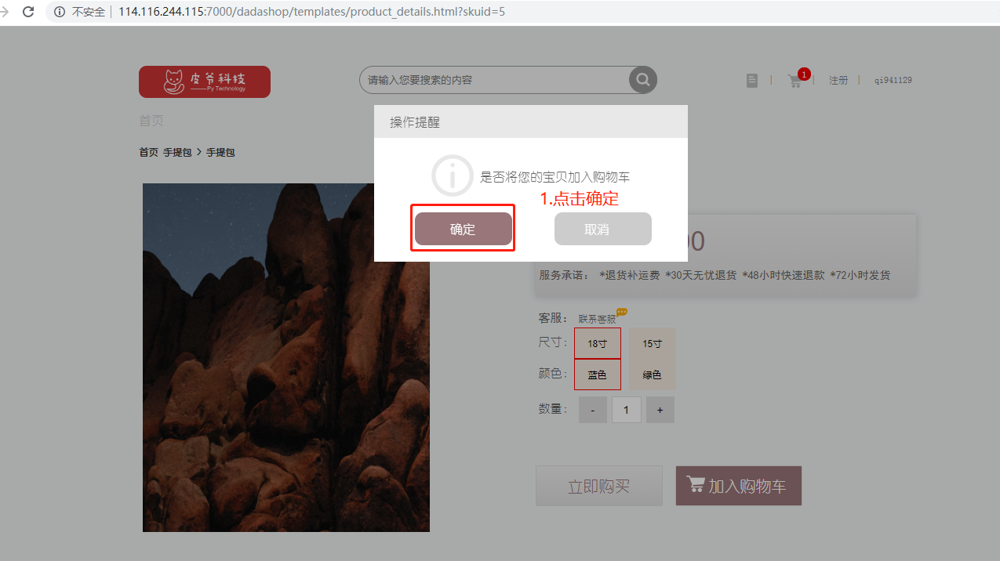


​	触发失败：


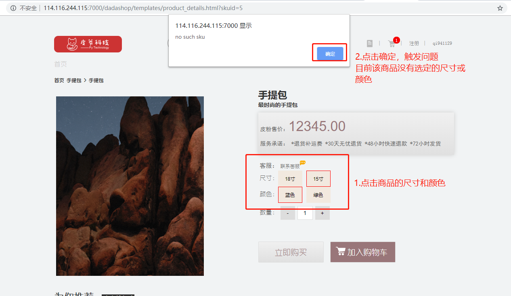

#### 前端代码:

前端的代码在product_detail.html 第345-447行。

```javascript
$("#add_cart").click(function (e) {
            $(".modal").show();
            $(".modal_information span").html("是否将您的宝贝加入购物车");
            $('.no').click(function () {
                $('.modal').hide();
            })
            $('.yes').click(function () {
                var username = window.localStorage.getItem('dashop_user');
                if (username){
                    $.ajax({
                    type: "post",
                    url:baseUrl+'/v1/carts/'+username,
                    beforeSend:function (request) {
                  request.setRequestHeader("authorization",localStorage.getItem('dashop_token'))
                    },
                    data: JSON.stringify({
                        sku_id: skuid,
                        count: $("#buy-num").val()
                    }),
                    success: function (data) {
                        var result = data;
                        if (result.code==200) {
                            console.log(result.data)
                            window.localStorage.setItem('dashop_count',result.data.length) 
                            alert("添加购物车成功！")
                            location.reload()
                        } else {
                            alert(result.error);
                        }
                    },
                    error: function (data) {
                        alert("系统异常！");
                    }
                });
                }else {
                    var data = []
                    function getData() {
                         var nameArr = [];
                        $(".spu_name").each(function() {
                            nameArr.push($(this).html());
                        });
                        var valueArr = [];
                        $(".spu_value").each(function() {
                             if ($(this).hasClass('spu_check')){
                                valueArr.push($(this).val());
                            }
                        });
                        var sku_data = {
                            id: skuid,
                            count: $("#buy-num").val(),
                            name: $('.right_detail').children('h3').html(),
                        default_image_url:$('#mImg').attr('src').replace('../static/media/',''),
                            price:parseInt($('#pro_price').children('span').html()) ,
                            selected: true,
                            sku_sale_attr_name:nameArr,
                            sku_sale_attr_val:valueArr
                            };
                        console.log(data)
                        data.push(sku_data)
                        console.log(data)
                    }
                    function addData (sku_data) {
                        var oldData = JSON.parse(window.localStorage.getItem('cart'));
                        var result = '';
                        if(oldData){
                            for(var i=0;i<oldData.length;i++){
                               if (oldData[i].id == sku_data[0].id){
                                   oldData[i].count = parseInt(oldData[i].count)+parseInt(sku_data[0].count);
                                   console.log(oldData[i].count)
                                   result = oldData
                               }else {
                                   result =  oldData.concat(sku_data)
                               }
                            }
                        }else{
                            result = sku_data
                        }
                        window.localStorage.setItem('cart',JSON.stringify(result))
                    }
                    function start() {
                        getData();
                        addData(data);
                        alert("离线添加购物车成功！");
                        location.reload();
                        $('.model').hide();
                    }
                   // setTimeout(start,1000);
                    start();
                }
            })
        })
```


**URL**： ``127.0.0.1:8000/v1/carts/<username> ``

**请求方式**：POST

**请求参数**：JSON

|  参数  | 类型 | 是否必须 |    说明    |
| :----: | :--: | :------: | :--------: |
| sku_id | int  |    是    | 商品sku_id |
| count  | int  |    是    |    数量    |

```
请求士例：
{ "sku_id":2,"count":"1"}
```

**返回值**：JSON

**响应格式**：

```
# 正确响应：
{"code":200,"data":skus_list}

# 错误响应：
{"code":xxx,"error":xxx}
```

| 字段  |   含义   | 类型 | 备注                        |
| :---: | :------: | :--: | --------------------------- |
| code  |  状态码  | int  | 默认正常为200，异常见状态码 |
| data  | 具体数据 | dict | 与error二选一               |
| error | 错误信息 | char | 与data二选一                |

skus_list参数信息

| 参数               | 类型    | 是否必须 | 说明                            |
| ------------------ | ------- | -------- | ------------------------------- |
| id                 | int     | 是       | 商品sku_id                      |
| name               | str     | 是       | 商品名称                        |
| count              | int     | 是       | 商品数量                        |
| default_image_url  | str     | 是       | 商品默认图片路径                |
| price              | decimal | 是       | 商品单价                        |
| sku_sale_attr_name | list    | 是       | 商品属性                        |
| sku_sale_attr_val  | list    | 是       | 商品属性值                      |
| selected           | int     | 是       | 商品的选中状态（0未选中,1选中） |

```python
#sku_list中数据示例 [{"id":"","name":"","count":"","selected":"","default_image_url":"","price":"","sku_sale_attr_na me":[],"sku_sale_attr_val":[]},{"":""...}]
```

状态码参数：

| 状态码 | 响应信息         | 原因短句                    |
| ------ | ---------------- | --------------------------- |
| 200    | 正常             | OK                          |
| 30101  | 未找到商品       | SKU query error             |
| 30102  | 传参不正确       | Incorrect pass of reference |
| 30103  | 购买数量超过库存 | exceeds the inventory       |
| 30104  | 未找到用户       | User query error            |

#### 后端代码:

```python
redis_conn = get_redis_connection('cart')
class CartVIew(View):    
    def dispatch(self, request, *args, **kwargs):
        if request.method in ("POST","DELETE"):
            cart_dict = json.loads(request.body)
            sku_id = cart_dict.get('sku_id')
            if not sku_id:
                return JsonResponse({'code': 30102, 'error': '没有sku_id参数'})
            try:
                sku = SKU.objects.get(id=sku_id)  # 11: 红袖添香
            except Exception as e:
                print(e)
                return JsonResponse({'code': 30101, 'error': "未找到商品"})
            request.cart_dict = cart_dict
            request.sku_id = sku_id
            request.sku = sku
            return super().dispatch(request, *args, **kwargs)
        return super().dispatch(request, *args, **kwargs)    
    
    
    @logging_check
    def post(self, request, username):
        cart_dict = request.cart_dict
        sku_id = request.sku_id
        sku = request.sku  # 11: 红袖添香
        count = cart_dict.get('count')
        try:
            count = int(count)
        except Exception as e:
            print(e)
            return JsonResponse({'code': 30102, 'error': "传参不正确"})
        if count > sku.stock:
            return JsonResponse({'code': 30103, 'error': '购买数量超过库存'})
        user = request.user
        if user.username != username:
            return JsonResponse({'code': 30104, 'error': '非登录者用户'})
        redis_cart = redis_conn.hgetall('cart_%d' % user.id) 

        # 如果redis中存在 则累增
        if sku_id.encode() in redis_cart.keys():
            redis_c = redis_conn.hget('cart_%d' % user.id, sku_id)  
            count_r = int(json.loads(redis_c)['count'])
            count_r += count
            status = json.dumps({'count': count_r, 'selected': 1})
            redis_conn.hset('cart_%d' % user.id, sku_id, status)
        # 否则hmset插入Redis
        else:
            # 默认都为勾选状态 1勾选 0未勾选
            status = json.dumps({'count': count, 'selected': 1}) 
            redis_conn.hset('cart_%d' % user.id, sku_id, status)
            print("管道2执行完毕")
        skus_list = self.get_cart_list(user.id)
        return JsonResponse({'code': 200, 'data': skus_list})
   
    
    def get_cart_list(self, user_id):
        '''
        :param user_id: 用户的id
        :return: reqsponse 列表 [{"id":"","name":"","count":"","selected":""},{"":""...}]
        '''
        cart_dict = {}
        # 重新去redis数据
        redis_cart = redis_conn.hgetall('cart_%d' % user_id)
        for sku_id, status in redis_cart.items():
            cart_dict[int(sku_id.decode())] = {
                'state': json.loads(status),
            }
        skus = SKU.objects.filter(id__in=cart_dict.keys())
        skus_list = []
        for sku in skus:
            sku_dict = {}
            sku_dict['id'] = sku.id
            sku_dict['name'] = sku.name
            sku_dict['count'] = int(cart_dict[sku.id]['state']['count'])
            sku_dict['selected'] = int(cart_dict[sku.id]['state']['selected'])
            sku_dict['default_image_url'] = str(sku.default_image_url)
            sku_dict['price'] = sku.price
            sku_sale_attr_name = []
            sku_sale_attr_val = []

            saleattr_vals = SaleAttrValue.objects.filter(sku_id=sku.id)
            for saleattr_val in saleattr_vals:
                #属性值
                sku_sale_attr_val.append(saleattr_val.sale_attr_value_name)
                #属性名称
                saleattrname = SPUSaleAttr.objects.filter(saleattrvalue=saleattr_val)[0]
                sku_sale_attr_name.append(saleattrname.sale_attr_name)

            sku_dict['sku_sale_attr_name'] = sku_sale_attr_name
            sku_dict['sku_sale_attr_val'] = sku_sale_attr_val
            skus_list.append(sku_dict)
        return skus_list

    
```


### 2.查询购物车

#### 事件触发:

页面名：**index.html**

页面名：**cart.html** 

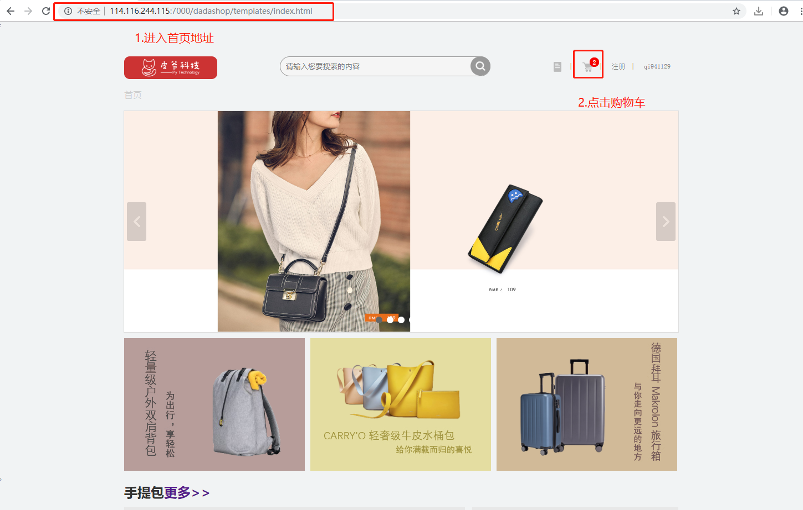

#### 触发结果:


#### 前端代码：

前端的代码在cart.js第327-357行。

```javascript
(function () {
     var username = window.localStorage.dashop_user;
     if (username) {
         $.ajax({
             type: "get",
             url: BASE_URL+'/v1/carts/'+username,
             datatype: JSON,
             beforeSend:function (request) {
                 request.setRequestHeader('authorization',window.localStorage.getItem('dashop_token'))
             },
             success: function (response) {
                 console.log(response)
                 result = JSON.stringify(response)
                 results = JSON.parse(result)
                 if (results.code == 200) {
                     var data = results.data;
                     var pic = response.base_url;
                     if (data.length == 0){
                         $("#go-buy").css("background","gray")
                         $("#go-buy").attr("disabled",true)
                     }
                     main(data,pic)
                 } else {
                     alert(results.error)
                 }
             },
             error: function (err) {
                 console.log(err);
             },
         })
     }else {
       	 // 如果用户没有登陆，那么从本地存储中获取数据。
         var data = JSON.parse(window.localStorage.getItem('cart'))
         console.log(data)
         main(data)
     }
})
```

**URL**： 127.0.0.1:8000/v1/carts/<username>

**请求方式**: GET

**请求参数**：无

**返回值**：JSON

**响应格式**：

```
# 正常响应： 
{"code":200,"data":skus_list}

# 异常响应
{"code":xxx,"error"：xxxx}
```

| 字段  | 含义     | 类型 | 备注                        |
| ----- | -------- | ---- | --------------------------- |
| code  | 状态码   | int  | 默认正常为200，异常见状态码 |
| data  | 具体数据 | dict | 与error二选一               |
| error | 错误信息 | char | 与data二选一                |

sku_list参数信息

| 参数               | 类型    | 是否必须 | 说明                             |
| ------------------ | ------- | -------- | -------------------------------- |
| id                 | int     | 是       | 商品sku_id                       |
| name               | str     | 是       | 商品名称                         |
| count              | int     | 是       | 商品数量                         |
| default_image_url  | str     | 是       | 商品默认图片路径                 |
| price              | decimal | 是       | 商品单价                         |
| sku_sale_attr_name | list    | 是       | 商品属性                         |
| sku_sale_attr_val  | list    | 是       | 商品属性值                       |
| selected           | int     | 是       | 商品的选中状态（0未选中，1选中） |

```python
#sku_list中数据示例 [{"id":"","name":"","count":"","selected":"","default_image_url":"","price":"","sku_sale_attr_na me":[],"sku_sale_attr_val":[]},{"":""...}]
```

状态码参数

| 状态码 | 响应信息   | 原因短语         |
| ------ | ---------- | ---------------- |
| 200    | 正常       | OK               |
| 30104  | 未找到用户 | User query error |

#### 后端代码:

```python
redis_conn = get_redis_connection('cart')
class CartVIew(View):
    @logging_check
    def get(self, request, username):
        user = request.user
        if user.username != username:
            return JsonResponse({'code': 30104, 'error': '非登录者用户'})
        redis_cart = redis_conn.hgetall('cart_%d' % user.id)
        for s_id in redis_cart.keys():
            redis_c = redis_conn.hget('cart_%d' % user.id, s_id)
            count_r = int(json.loads(redis_c)['count'])
            status = json.dumps({'count': count_r, 'selected': 1})
            redis_conn.hset('cart_%d' % user.id, s_id, status)
        skus_list = self.get_cart_list(user.id)
        return JsonResponse({'code': 200, 'data': skus_list}) 


   def get_cart_list(self, user_id):
        '''
        :param user_id: 用户的id
        :return: reqsponse 列表 [{"id":"","name":"","count":"","selected":""},{"":""...}]
        '''
        cart_dict = {}
        # 重新去redis数据
        redis_cart = redis_conn.hgetall('cart_%d' % user_id)
        for sku_id, status in redis_cart.items():
            cart_dict[int(sku_id.decode())] = {
                'state': json.loads(status),
            }
        skus = SKU.objects.filter(id__in=cart_dict.keys())
        skus_list = []
        for sku in skus:
            sku_dict = {}
            sku_dict['id'] = sku.id
            sku_dict['name'] = sku.name
            sku_dict['count'] = int(cart_dict[sku.id]['state']['count'])
            sku_dict['selected'] = int(cart_dict[sku.id]['state']['selected'])
            sku_dict['default_image_url'] = str(sku.default_image_url)
            sku_dict['price'] = sku.price
            sku_sale_attr_name = []
            sku_sale_attr_val = []

            saleattr_vals = SaleAttrValue.objects.filter(sku_id=sku.id)
            for saleattr_val in saleattr_vals:
                #属性值
                sku_sale_attr_val.append(saleattr_val.sale_attr_value_name)
                #属性名称
                saleattrname = SPUSaleAttr.objects.filter(saleattrvalue=saleattr_val)[0]
                sku_sale_attr_name.append(saleattrname.sale_attr_name)

            sku_dict['sku_sale_attr_name'] = sku_sale_attr_name
            sku_dict['sku_sale_attr_val'] = sku_sale_attr_val
            skus_list.append(sku_dict)
        return skus_list

```


### 3.删除购物车数据

#### 事件触发:

页面名：**cart.html** 

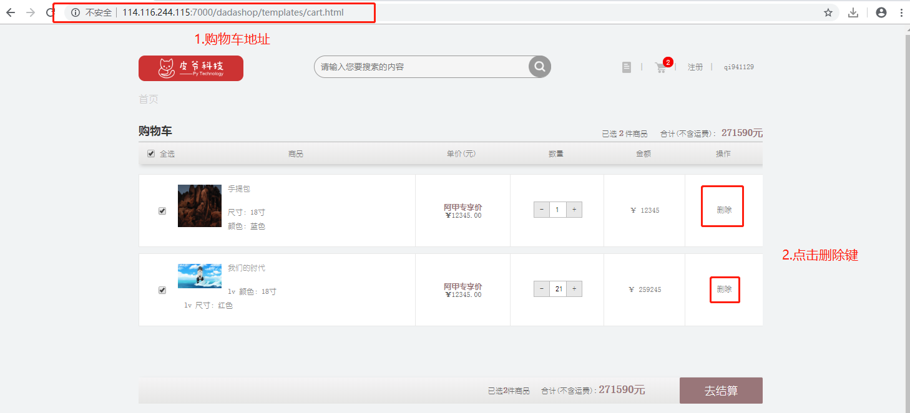

#### 触发结果:

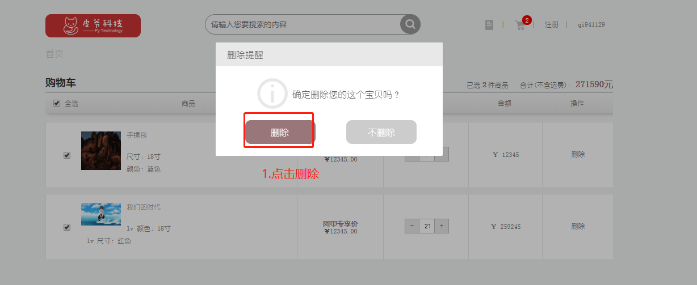


#### 前端代码:

前端的代码在cart.js第76-114行。

```javascript
delItem: function (index) {
            $(".Each input[type='checkbox']").each(function (i, e) {
                if ($(e).val() == index) {
                    var username = window.localStorage.dashop_user;
                    if (username){
                        $.ajax({
                        url: BASE_URL+'/v1/carts/' + username,
                        type: "DELETE",
                        beforeSend:function (request) {
                 request.setRequestHeader('authorization',window.localStorage.getItem('dashop_token'))
             },
                        dataType: "json",
                        data: JSON.stringify({'sku_id': index}),
                        success: function (result) {
                            window.localStorage.setItem('dashop_count',result.data.length)
                            $('.my_cart_count').html(result.data.length)
                            if(result.data.length == 0){
                                    $("#go-buy").css("background","gray")
                                    $("#go-buy").attr("disabled",true)
                            }
                        }
                    });
                    }else {
                        var result = '';
                        for(var j=0;j<data.length;j++){
                           if (data[j].id == index){
                               data.splice(j,1);
                               result = data;
                               console.log(data);
                           }
                        }
                        window.localStorage.setItem('cart',JSON.stringify(result))
                    }
                    $(".imfor").each(function (i2, e2) {
                        if (i == i2) {
                            $(e2).remove();
                        }
                    })
                }
            })
        }
    }
```

**URL**： 127.0.0.1:8000/v1/carts/<username> 

**请求方式**：DELETE

**请求参数**

```python
#请求参数示例： 
{"sku_id":1001}
```

| 参数   | 类型 | 是否必须 | 说明       |
| ------ | ---- | -------- | ---------- |
| sku_id | int  | 是       | 商品sku_id |

**返回值**：json

**响应格式**：

```python
# 正常响应： 
{"code":200,"data":skus_list}

# 异常响应
{"code":xxx,"error"：xxxx}
```

| 字段  | 含义     | 类型 | 备注                            |
| ----- | -------- | ---- | ------------------------------- |
| code  | 状态码   | int  | 默认正常为200，异常见状态码参考 |
| data  | 具体数据 | dict | 与error二选一                   |
| error | 错误信息 | char | 与data二选一                    |

skus_list参数信息

| 参数               | 类型    | 是否必须 | 说明                             |
| ------------------ | ------- | -------- | -------------------------------- |
| id                 | int     | 是       | 商品sku_id                       |
| name               | str     | 是       | 商品名称                         |
| count              | int     | 是       | 商品数量                         |
| default_image_url  | str     | 是       | 商品默认图片路径                 |
| price              | decimal | 是       | 商品单价                         |
| sku_sale_attr_name | list    | 是       | 商品属性                         |
| sku_sale_attr_val  | list    | 是       | 商品属性值                       |
| selected           | int     | 是       | 商品的选中状态（0未选中，1选中） |

```python
#sku_list中数据示例 [{"id":"","name":"","count":"","selected":"","default_image_url":"","price":"","sku_sale_attr_na me":[],"sku_sale_attr_val":[]},{"":""...}]
```

状态码参考

| 状态码 | 响应信息   | 原因短句         |
| ------ | ---------- | ---------------- |
| 200    | 正常       | OK               |
| 30101  | 未找到商品 | SKU query error  |
| 30104  | 未找到用户 | User query error |

#### 后端代码

```python
redis_conn = get_redis_connection('cart')
class CartVIew(View):
    def dispatch(self, request, *args, **kwargs):
        if request.method in ("POST","DELETE"):
            cart_dict = json.loads(request.body)
            sku_id = cart_dict.get('sku_id')
            if not sku_id:
                return JsonResponse({'code': 30102, 'error': '没有sku_id参数'})
            try:
                sku = SKU.objects.get(id=sku_id)  # 11: 红袖添香
            except Exception as e:
                print(e)
                return JsonResponse({'code': 30101, 'error': "未找到商品"})
            request.cart_dict = cart_dict
            request.sku_id = sku_id
            request.sku = sku
            return super().dispatch(request, *args, **kwargs)
        return super().dispatch(request, *args, **kwargs)
    
    @logging_check
    def delete(self, request, username):
        sku_id = request.sku_id
        user = request.user
        if user.username != username:
            return JsonResponse({'code': 30104, 'error': '非登录者用户'})

        # 从hash值中删除该SKU_ID
        redis_conn.hdel('cart_%d' % user.id, sku_id)
        skus_list = self.get_cart_list(user.id)
        return JsonResponse({'code': 200, 'data': skus_list})
    
    
    
     def get_cart_list(self, user_id):
        '''
        :param user_id: 用户的id
        :return: reqsponse 列表 [{"id":"","name":"","count":"","selected":""},{"":""...}]
        '''
        cart_dict = {}
        # 重新去redis数据
        redis_cart = redis_conn.hgetall('cart_%d' % user_id)
        for sku_id, status in redis_cart.items():
            cart_dict[int(sku_id.decode())] = {
                'state': json.loads(status),
            }
        skus = SKU.objects.filter(id__in=cart_dict.keys())
        skus_list = []
        for sku in skus:
            sku_dict = {}
            sku_dict['id'] = sku.id
            sku_dict['name'] = sku.name
            sku_dict['count'] = int(cart_dict[sku.id]['state']['count'])
            sku_dict['selected'] = int(cart_dict[sku.id]['state']['selected'])
            sku_dict['default_image_url'] = str(sku.default_image_url)
            sku_dict['price'] = sku.price
            sku_sale_attr_name = []
            sku_sale_attr_val = []

            saleattr_vals = SaleAttrValue.objects.filter(sku_id=sku.id)
            for saleattr_val in saleattr_vals:
                #属性值
                sku_sale_attr_val.append(saleattr_val.sale_attr_value_name)
                #属性名称
                saleattrname = SPUSaleAttr.objects.filter(saleattrvalue=saleattr_val)[0]
                sku_sale_attr_name.append(saleattrname.sale_attr_name)

            sku_dict['sku_sale_attr_name'] = sku_sale_attr_name
            sku_dict['sku_sale_attr_val'] = sku_sale_attr_val
            skus_list.append(sku_dict)
        return skus_list

 
```


### 4.购物车页面商品数量增加

#### 事件触发:

页面名：**cart.html** 

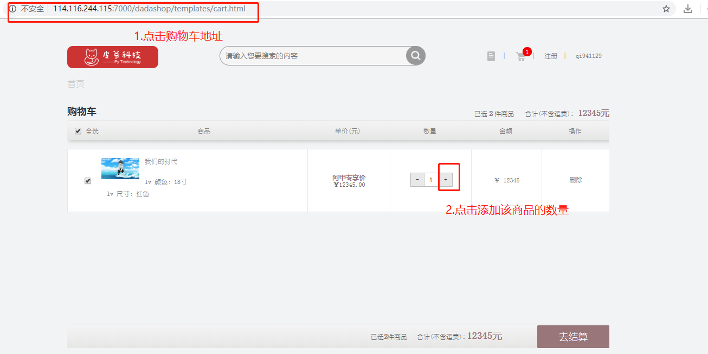

#### 触发结果:

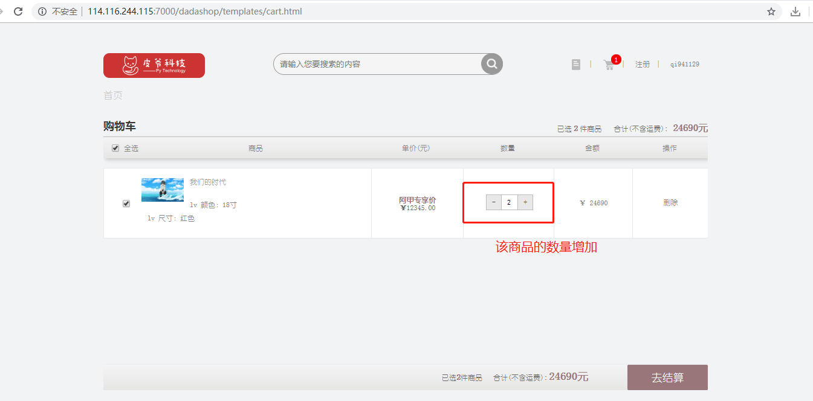

#### 前端代码:

前端的代码在cart.js第161-203行。

```javascript
$(".add").each(function (i, e) {
        $(e).on("click", function () {
            //alert(i)
            var _v = $(this).prev();
            var _v2 = Number(_v.val());
            if (_v2 < 10) {
                _v2++;
                _v.val(_v2)
                if ($(this).parent().parent().children('.check').children('.Each').children().prop('checked')){
                    var _price = parseInt($(this).parent().prev().children('.pices_information').children('.pices_price').text());
                    var _totalprice = parseInt($(".susumOne").text());
                   _totalprice += _price;
                   console.log(_price)
                    console.log(_totalprice)
               $(".susumOne,.susum").text(_totalprice)
                }
            }
            var _id = _v.data("id");
            $(".totle_information").each(function (i2, e2) {
                if (_id == $(e2).data("id")) {
                    var _p = data[i2].price;
                    $(e2).html(_p * _v2)
                }
            });
            var username = window.localStorage.dashop_user;
            var sku_id = $(this).parent().parent().children('.check').children('.Each').children().val()

            $.ajax({
                url :  BASE_URL+'/v1/carts/'+username,
                type : "PUT",
                dataType: "json",
                beforeSend:function (request) {
           request.setRequestHeader('authorization',window.localStorage.getItem('dashop_token'))
             },
                data :JSON.stringify({'sku_id':sku_id,'count':_v2,'state':'add'}) ,
                success : function(result) {
                }
            });
        })
    })
```

**URL**： 127.0.0.1:8000/v1/carts/<username> 

**请求方式**：PUT

**请求参数**：JSON

| 参数   | 类型 | 是否必须 | 说明           |
| ------ | ---- | -------- | -------------- |
| sku_id | int  | 是       | 商品sku_id     |
| count  | int  | 是       | 前端显示的数量 |
| state  | str  | 是       | 判断事件状态   |

```python
#请求示例 
{'sku_id':1001,count:1,state:'add'}
```

**返回值**：JSON

**响应格式**：

```python
# 正常响应： 
{"code":200,"data":skus_list}

# 异常响应
{"code":xxx,"error"：xxxx}
```

| 字段  | 含义     | 类型 | 备注                        |
| ----- | -------- | ---- | --------------------------- |
| code  | 状态码   | int  | 默认正常为200，异常见状态码 |
| data  | 具体数据 | dict | 与error二选一               |
| error | 错误信息 | char | 与data二选一                |

skus_list参数信息

| 参数               | 类型    | 是否必须 | 说明                             |
| ------------------ | ------- | -------- | -------------------------------- |
| id                 | int     | 是       | 商品sku_id                       |
| name               | str     | 是       | 商品名称                         |
| count              | int     | 是       | 商品数量                         |
| default_image_url  | str     | 是       | 商品默认图片路径                 |
| price              | decimal | 是       | 商品单价                         |
| sku_sale_attr_name | list    | 是       | 商品属性                         |
| sku_sale_attr_val  | list    | 是       | 商品属性值                       |
| selected           | int     | 是       | 商品的选中状态（0未选中，1选中） |

```python
#sku_list中数据示例 [{"id":"","name":"","count":"","selected":"","default_image_url":"","price":"","sku_sale_attr_na me":[],"sku_sale_attr_val":[]},{"":""...}]
```

状态码参考

| 状态码 | 响应信息   | 原因短语         |
| ------ | ---------- | ---------------- |
| 200    | 正常       | OK               |
| 30101  | 未找到商品 | SKU query error  |
| 30104  | 未找到用户 | User query error |

#### 后端代码

```python
redis_conn = get_redis_connection('cart')

class CartVIew(View):
    @logging_check
    def put(self, request, username):
        cart_dict = json.loads(request.body)
        state = cart_dict.get('state')
        user = request.user
        if user.username != username:
            return JsonResponse({'code': 30104, 'error': '非登录者用户'})

        # 判断增加还是减少
        if state == 'add' or state == "del":
            sku_id = cart_dict.get('sku_id')
            try:
                sku = SKU.objects.get(id=sku_id)
            except Exception as e:
                return JsonResponse({'code': 30101, 'error': "未找到商品"})
            redis_c = redis_conn.hget('cart_%d' % user.id, sku_id)
            if not redis_c:
                return JsonResponse({'code': 30101, 'error': '未找到商品'})

            # 检查数据
            if state == 'add':
                count = int(json.loads(redis_c)['count'])
                # 向hash中存储商品的ID,和数量
                count += 1
                if count_r > sku.stock:
                    return JsonResponse({'code': 30103, 'error': '购买数量超过库存'})
                status = json.dumps({'count': count, 'selected': 1})
                redis_conn.hset('cart_%d' % user.id, sku.id, status)
                skus_list = self.get_cart_list(user.id)
                return JsonResponse({'code': 200, 'data': skus_list})
            
            
    def get_cart_list(self, user_id):
        '''
        :param user_id: 用户的id
        :return: reqsponse 列表 [{"id":"","name":"","count":"","selected":""},{"":""...}]
        '''
        cart_dict = {}
        # 重新去redis数据
        redis_cart = redis_conn.hgetall('cart_%d' % user_id)
        for sku_id, status in redis_cart.items():
            cart_dict[int(sku_id.decode())] = {
                'state': json.loads(status),
            }
        skus = SKU.objects.filter(id__in=cart_dict.keys())
        skus_list = []
        for sku in skus:
            sku_dict = {}
            sku_dict['id'] = sku.id
            sku_dict['name'] = sku.name
            sku_dict['count'] = int(cart_dict[sku.id]['state']['count'])
            sku_dict['selected'] = int(cart_dict[sku.id]['state']['selected'])
            sku_dict['default_image_url'] = str(sku.default_image_url)
            sku_dict['price'] = sku.price
            sku_sale_attr_name = []
            sku_sale_attr_val = []

            saleattr_vals = SaleAttrValue.objects.filter(sku_id=sku.id)
            for saleattr_val in saleattr_vals:
                #属性值
                sku_sale_attr_val.append(saleattr_val.sale_attr_value_name)
                #属性名称
                saleattrname = SPUSaleAttr.objects.filter(saleattrvalue=saleattr_val)[0]
                sku_sale_attr_name.append(saleattrname.sale_attr_name)

            sku_dict['sku_sale_attr_name'] = sku_sale_attr_name
            sku_dict['sku_sale_attr_val'] = sku_sale_attr_val
            skus_list.append(sku_dict)
        return skus_list

```


### 5.购物车页面商品数量减少

#### 事件触发

页面名：**cart.html** 

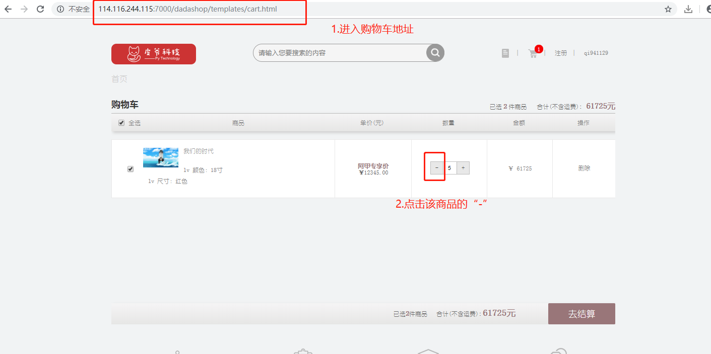

#### 触发结果

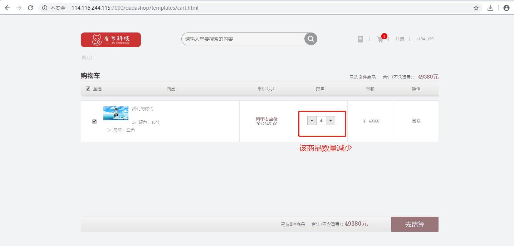

#### 前端代码

前端的代码在cart.js第120-160行。

```javascript
$(".reduc").each(function (i, e) {
        $(e).on("click", function () {
            //alert(i)
            var _v = $(this).next();
            var _v2 = Number(_v.val());
            if (_v2 > 1) {
                _v2--;
                _v.val(_v2);
                if ($(this).parent().parent().children('.check').children('.Each').children().prop('checked')){
                    var _price = parseInt($(this).parent().prev().children('.pices_information').children('.pices_price').text());
                    var _totalprice = parseInt($(".susumOne").text());
                    console.log(_price)
                    console.log(_totalprice)
                    _totalprice -= _price;
                    $(".susumOne,.susum").text(_totalprice)
                }
            }
            var _id = _v.data("id");
            $(".totle_information").each(function (i2, e2) {
                if (_id == $(e2).data("id")) {
                    var _p = data[i2].price;
                    $(e2).html(_p * _v2)
                }
            })
            var username = window.localStorage.dashop_user;
            var sku_id = $(this).parent().parent().children('.check').children('.Each').children().val()
            $.ajax({
                url : BASE_URL+'/v1/carts/'+username,
                type : "PUT",
                beforeSend:function (request) {
                 request.setRequestHeader('authorization',window.localStorage.getItem('dashop_token'))
             },
                dataType: "json",
                data : JSON.stringify({'sku_id':sku_id,'count':_v2,'state':'del'}) ,
                success : function(result) {
                console.log(result.msg);
                }
            });

            })
        })
```

**URL**： 127.0.0.1:8000/v1/carts/<username> 

**请求方式**: PUT

**请求参数**：JSON

| 参数   | 类型 | 是否必须 | 说明         |
| ------ | ---- | -------- | ------------ |
| sku_id | int  | 是       | 商品的sku_id |
| count  | int  | 是       | 前端显示数量 |
| state  | str  | 是       | 判断事件状态 |

```python
#请求示例： 
{'sku_id':1001,count:1,state:'del'}
```

**返回值**：JSON

**响应格式**：

```
# 正常响应： 
{"code":200,"data":skus_list}

# 异常响应
{"code":xxx,"error"：xxxx}
```

| 字段  | 含义     | 类型 | 备注                        |
| ----- | -------- | ---- | --------------------------- |
| code  | 状态码   | int  | 默认正常为200，异常见状态码 |
| data  | 具体数据 | dict | 与error二选一               |
| error | 错误信息 | char | 与data二选一                |

skus_list参数信息

| 参数               | 类型    | 是否必须 | 说明                             |
| ------------------ | ------- | -------- | -------------------------------- |
| id                 | int     | 是       | 商品sku_id                       |
| name               | str     | 是       | 商品名称                         |
| count              | int     | 是       | 商品数量                         |
| default_image_url  | str     | 是       | 商品默认图片路径                 |
| price              | decimal | 是       | 商品单价                         |
| sku_sale_attr_name | list    | 是       | 商品属性                         |
| sku_sale_attr_val  | list    | 是       | 商品属性值                       |
| selected           | int     | 是       | 商品的选中类型（0未选中，1选中） |

```python
#sku_list中数据示例 [{"id":"","name":"","count":"","selected":"","default_image_url":"","price":"","sku_sale_attr_na me":[],"sku_sale_attr_val":[]},{"":""...}]
```

状态码参数

| 状态码 | 响应信息   | 原因短语         |
| ------ | ---------- | ---------------- |
| 200    | 正常       | OK               |
| 30101  | 未找到商品 | SKU query error  |
| 30104  | 未找到用户 | User query error |

#### 后端代码

```python
redis_conn = get_redis_connection('cart')

class CartVIew(View):
    @logging_check
    def put(self, request, username):
        cart_dict = json.loads(request.body)
        state = cart_dict.get('state')
        user = request.user
        if user.username != username:
            return JsonResponse({'code': 30104, 'error': '非登录者用户'})

        # 判断增加还是减少
        if state == 'add' or state == "del":
            sku_id = cart_dict.get('sku_id')
            try:
                sku = SKU.objects.get(id=sku_id)
            except Exception as e:
                return JsonResponse({'code': 30101, 'error': "未找到商品"})
            redis_c = redis_conn.hget('cart_%d' % user.id, sku_id)
            if not redis_c:
                return JsonResponse({'code': 30101, 'error': '未找到商品'})
         # 检查数据

            if state == 'del':
                count = int(json.loads(redis_c)['count'])
                if count > 1:
                    count -= 1
                    status = json.dumps({'count': count, 'selected': 1})
                    redis_conn.hset('cart_%d' % user.id, sku.id, status)
                    skus_list = self.get_cart_list(user.id)
                else:
                    status = json.dumps({'count': 1, 'selected': 1})
                    redis_conn.hset('cart_%d' % user.id, sku.id, status)
                    skus_list = self.get_cart_list(user.id)
                return JsonResponse({'code': 200, 'data': skus_list})
            
    def get_cart_list(self, user_id):
        '''
        :param user_id: 用户的id
        :return: reqsponse 列表 [{"id":"","name":"","count":"","selected":""},{"":""...}]
        '''
        cart_dict = {}
        # 重新去redis数据
        redis_cart = redis_conn.hgetall('cart_%d' % user_id)
        for sku_id, status in redis_cart.items():
            cart_dict[int(sku_id.decode())] = {
                'state': json.loads(status),
            }
        skus = SKU.objects.filter(id__in=cart_dict.keys())
        skus_list = []
        for sku in skus:
            sku_dict = {}
            sku_dict['id'] = sku.id
            sku_dict['name'] = sku.name
            sku_dict['count'] = int(cart_dict[sku.id]['state']['count'])
            sku_dict['selected'] = int(cart_dict[sku.id]['state']['selected'])
            sku_dict['default_image_url'] = str(sku.default_image_url)
            sku_dict['price'] = sku.price
            sku_sale_attr_name = []
            sku_sale_attr_val = []

            saleattr_vals = SaleAttrValue.objects.filter(sku_id=sku.id)
            for saleattr_val in saleattr_vals:
                #属性值
                sku_sale_attr_val.append(saleattr_val.sale_attr_value_name)
                #属性名称
                saleattrname = SPUSaleAttr.objects.filter(saleattrvalue=saleattr_val)[0]
                sku_sale_attr_name.append(saleattrname.sale_attr_name)

            sku_dict['sku_sale_attr_name'] = sku_sale_attr_name
            sku_dict['sku_sale_attr_val'] = sku_sale_attr_val
            skus_list.append(sku_dict)
        return skus_list

```


### 6.购物车商品单选

#### 事件触发

页面名：**cart.html** 

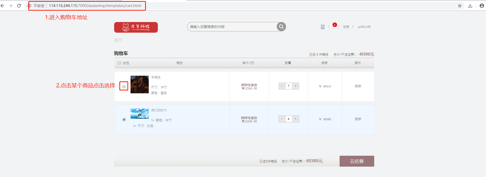

#### 触发结果

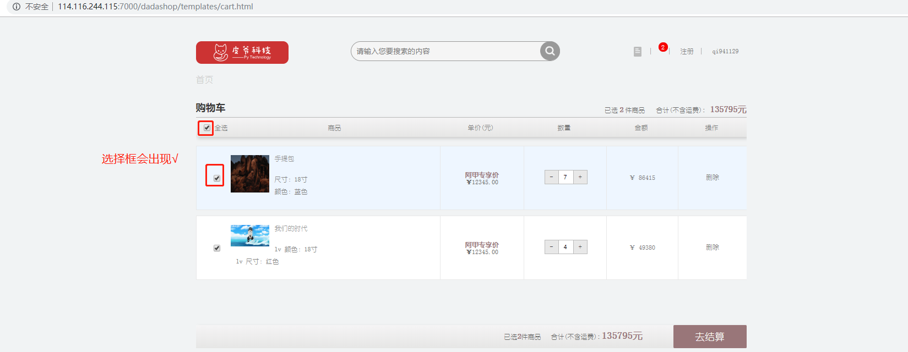

#### 前端代码

前端的代码在cart.js第213-244行。

```javascript
if ($(this).prop('checked')) {
            var amou = parseInt($('.total').text());
            amou++;
            $('.total').text(amou);
            $('.totalOne').text(amou);
            var newamo = parseInt($('.susum').text()) + parseInt($(this).parent().parent().siblings('.totle').children('.totle_information').text());
            $('.susum').text(newamo);
            $('.susumOne').text(newamo);
            console.log($(".Each input[type=checkbox]:not(:checked)"))
            if($(".Each input[type=checkbox]:checked").length > 0){
                $("#go-buy").css("background","#997679")
                $("#go-buy").attr("disabled",false)
                
            }
            if($(".Each input[type=checkbox]:not(:checked)").length > 0){
                $("input[name=allcheck]").attr("checked",false)
            }
            if($(".Each input[type=checkbox]:not(:checked)").length == 0){
                $("input[name=allcheck]").prop("checked",true)
            }   
            $.ajax({
                url :  BASE_URL+'/v1/carts/'+username,
                type : "PUT",
                dataType: "json",
                beforeSend:function (request) {
                 request.setRequestHeader('authorization',window.localStorage.getItem('dashop_token'))
             },
                data : JSON.stringify({'sku_id':sku_id,'state':'select'}) ,
                success : function(result) {
                }
            });
        }
```

**URL**： 127.0.0.1:8000/v1/carts/<username>

**请求方式:** PUT

**请求参数**：JSON

| 参数   | 类型 | 是否必须 | 说明                   |
| ------ | ---- | -------- | ---------------------- |
| sku_id | int  | 是       | 购物车显示商品的sku_id |
| state  | str  | 是       | 判断事件状态           |

```python
#请求示例 
{'sku_id':1001,state:'select'}
```

**返回值**：JSON

**响应格式**

```python
# 正常响应： 
{"code":200,"data":skus_list}

# 异常响应
{"code":xxx,"error"：xxxx}
```

| 字段  | 含义     | 类型 | 备注                            |
| ----- | -------- | ---- | ------------------------------- |
| code  | 状态码   | int  | 默认正常为200，异常见状态码参考 |
| data  | 具体数据 | dict | 与error二选一                   |
| error | 错误信息 | char | 与data二选一                    |

skus_list参数信息

| 参数               | 类型    | 是否必须 | 说明                             |
| ------------------ | ------- | -------- | -------------------------------- |
| id                 | int     | 是       | 商品sku_id                       |
| name               | str     | 是       | 商品名称                         |
| count              | int     | 是       | 商品数量                         |
| default_image_url  | str     | 是       | 商品默认图片路径                 |
| price              | decimal | 是       | 商品单价                         |
| sku_sale_attr_name | list    | 是       | 商品属性                         |
| sku_sale_attr_val  | list    | 是       | 商品属性值                       |
| selected           | int     | 是       | 商品的选中状态（0未选中，1选中） |

```python
#sku_list中数据示例 [{"id":"","name":"","count":"","selected":"","default_image_url":"","price":"","sku_sale_attr_na me":[],"sku_sale_attr_val":[]},{"":""...}]
```

状态码参考

| 状态码 | 响应信息   | 原因短语         |
| ------ | ---------- | ---------------- |
| 200    | 正常       | OK               |
| 30101  | 未找到商品 | SKU query error  |
| 30104  | 未找到用户 | User query error |

#### 后端代码

```python
redis_conn = get_redis_connection('cart')

class CartVIew(View):
    @logging_check
    def put(self, request, username):
        cart_dict = json.loads(request.body)
        state = cart_dict.get('state')
        user = request.user
        if user.username != username:
            return JsonResponse({'code': 30104, 'error': '非登录者用户'})
        
        if state == 'select' or state == 'unselect':
            sku_id = cart_dict.get('sku_id')
            # 勾选
            if state == 'select':
                skus_list = self.set_select_unselect(user.id, sku_id, 1)
                return JsonResponse({'code': 200, 'data': skus_list}) 
    
    
    def set_select_unselect(self, user_id, sku_id, selected):
        '''
        put 请求的state 状态 select 和  unselect
        :param user_id: 用户id user.id
        :param sku_id: 商品id int sku_id
        :param selected: 状态码（0/1)
        :return: 响应列表 [{"id":"","name":"","count":"","selected":""},{"":""...}]
        '''
        redis_c = redis_conn.hget('cart_%d' % user_id, sku_id)
        if not redis_c:
            return JsonResponse({'code': 30101, 'error': '未找到商品'})
        count = int(json.loads(redis_c)['count'])
        status = json.dumps({'count': count, 'selected': selected})
        redis_conn.hset('cart_%d' % user_id, sku_id, status)
        skus_list = self.get_cart_list(user_id)
        return skus_list

    
    def get_cart_list(self, user_id):
        '''
        :param user_id: 用户的id
        :return: reqsponse 列表 [{"id":"","name":"","count":"","selected":""},{"":""...}]
        '''
        cart_dict = {}
        # 重新去redis数据
        redis_cart = redis_conn.hgetall('cart_%d' % user_id)
        for sku_id, status in redis_cart.items():
            cart_dict[int(sku_id.decode())] = {
                'state': json.loads(status),
            }
        skus = SKU.objects.filter(id__in=cart_dict.keys())
        skus_list = []
        for sku in skus:
            sku_dict = {}
            sku_dict['id'] = sku.id
            sku_dict['name'] = sku.name
            sku_dict['count'] = int(cart_dict[sku.id]['state']['count'])
            sku_dict['selected'] = int(cart_dict[sku.id]['state']['selected'])
            sku_dict['default_image_url'] = str(sku.default_image_url)
            sku_dict['price'] = sku.price
            sku_sale_attr_name = []
            sku_sale_attr_val = []

            saleattr_vals = SaleAttrValue.objects.filter(sku_id=sku.id)
            for saleattr_val in saleattr_vals:
                #属性值
                sku_sale_attr_val.append(saleattr_val.sale_attr_value_name)
                #属性名称
                saleattrname = SPUSaleAttr.objects.filter(saleattrvalue=saleattr_val)[0]
                sku_sale_attr_name.append(saleattrname.sale_attr_name)

            sku_dict['sku_sale_attr_name'] = sku_sale_attr_name
            sku_dict['sku_sale_attr_val'] = sku_sale_attr_val
            skus_list.append(sku_dict)
        return skus_list

```


### 7.购物车商品取消单选

#### 事件触发

页面名：**cart.html** 


#### 触发结果

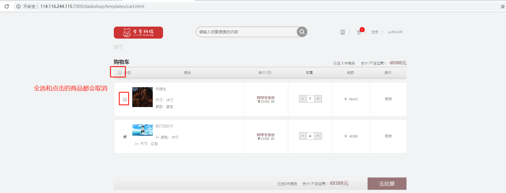

#### 前端代码

前端的代码在cart.js第244-275行。

```javascript
{
            var amou = parseInt($('.total').text());
            amou--;
            $('.total').text(amou);
            $('.totalOne').text(amou);
            var newamo = parseInt($('.susum').text()) - parseInt($(this).parent().parent().siblings('.totle').children('.totle_information').text());
            $('.susum').text(newamo);
            $('.susumOne').text(newamo);
            if($(".Each input[type=checkbox]:checked").length == 0){
                $("#go-buy").css("background","gray")
                $("#go-buy").attr("disabled",true)
            }
            if($(".Each input[type=checkbox]:not(:checked)").length > 0){
                $("input[name=allcheck]").attr("checked",false)
            }
            if($(".Each input[type=checkbox]:not(:checked)").length == 0){
                $("input[name=allcheck]").prop("checked",true)
            }           
            $.ajax({
                url :  BASE_URL+'/v1/carts/'+username,
                type : "PUT",
                dataType: "json",
                beforeSend:function (request) {
                 request.setRequestHeader('authorization',window.localStorage.getItem('dashop_token'))
             },
                data : JSON.stringify({'sku_id':sku_id,'state':'unselect'}) ,
                success : function(result) {
                console.log(result.msg);

                }
            });
        }
```


**URL**： 127.0.0.1:8000/v1/carts/<username>

**请求方式**: PUT

**请求参数**：JSON

| 参数   | 类型 | 是否必须 | 说明                   |
| ------ | ---- | -------- | ---------------------- |
| state  | str  | 是       | 判断事件状态           |
| sku_id | int  | 是       | 购物车显示商品的sku_id |

```python
#请求示例 
{'sku_id':1001,state:'unselect'}
```

**返回值**:JSON

**响应格式**:

```python
# 正常响应： 
{"code":200,"data":skus_list}

# 异常响应
{"code":xxx,"error"：xxxx}
```

| 字段  | 含义     | 类型 | 备注                            |
| ----- | -------- | ---- | ------------------------------- |
| code  | 状态码   | int  | 默认正确为200，异常见状态码参考 |
| data  | 具体数据 | dict | 与error二选一                   |
| error | 错误信息 | char | 与data二选一                    |

skus_list参数信息

| 参数               | 类型    | 是否必须 | 说明                             |
| ------------------ | ------- | -------- | -------------------------------- |
| id                 | int     | 是       | 商品sku_id                       |
| name               | str     | 是       | 商品名称                         |
| count              | int     | 是       | 商品数量                         |
| default_image_url  | str     | 是       | 商品默认图片路径                 |
| price              | decimal | 是       | 商品单价                         |
| sku_sale_attr_name | list    | 是       | 商品属性                         |
| sku_sale_attr_val  | list    | 是       | 商品属性值                       |
| selected           | int     | 是       | 商品的选中状态（0未选中，1选中） |

```python
#sku_list中数据示例 [{"id":"","name":"","count":"","selected":"","default_image_url":"","price":"","sku_sale_attr_na me":[],"sku_sale_attr_val":[]},{"":""...}]
```

状态码参考

| 状态码 | 响应信息   | 原因短语         |
| ------ | ---------- | ---------------- |
| 200    | 正常       | OK               |
| 30101  | 未找到商品 | SKU query error  |
| 30104  | 未找到用户 | User query error |

#### 后端代码

```python
redis_conn = get_redis_connection('cart')

class CartVIew(View):
    @logging_check
    def put(self, request, username):
        cart_dict = json.loads(request.body)
        state = cart_dict.get('state')
        user = request.user
        if user.username != username:
            return JsonResponse({'code': 30104, 'error': '非登录者用户'})

 
        if state == 'select' or state == 'unselect':
            sku_id = cart_dict.get('sku_id')
            # 取消勾选
            if state == 'unselect':
                skus_list = self.set_select_unselect(user.id, sku_id, 0)
                return JsonResponse({'code': 200, 'data': skus_list})
            
            
    def set_select_unselect(self, user_id, sku_id, selected):
        '''
        put 请求的state 状态 select 和  unselect
        :param user_id: 用户id user.id
        :param sku_id: 商品id int sku_id
        :param selected: 状态码（0/1)
        :return: 响应列表 [{"id":"","name":"","count":"","selected":""},{"":""...}]
        '''
        redis_c = redis_conn.hget('cart_%d' % user_id, sku_id)
        if not redis_c:
            return JsonResponse({'code': 30101, 'error': '未找到商品'})
        count = int(json.loads(redis_c)['count'])
        status = json.dumps({'count': count, 'selected': selected})
        redis_conn.hset('cart_%d' % user_id, sku_id, status)
        skus_list = self.get_cart_list(user_id)
        return skus_list

    
    
     def get_cart_list(self, user_id):
        '''
        :param user_id: 用户的id
        :return: reqsponse 列表 [{"id":"","name":"","count":"","selected":""},{"":""...}]
        '''
        cart_dict = {}
        # 重新去redis数据
        redis_cart = redis_conn.hgetall('cart_%d' % user_id)
        for sku_id, status in redis_cart.items():
            cart_dict[int(sku_id.decode())] = {
                'state': json.loads(status),
            }
        skus = SKU.objects.filter(id__in=cart_dict.keys())
        skus_list = []
        for sku in skus:
            sku_dict = {}
            sku_dict['id'] = sku.id
            sku_dict['name'] = sku.name
            sku_dict['count'] = int(cart_dict[sku.id]['state']['count'])
            sku_dict['selected'] = int(cart_dict[sku.id]['state']['selected'])
            sku_dict['default_image_url'] = str(sku.default_image_url)
            sku_dict['price'] = sku.price
            sku_sale_attr_name = []
            sku_sale_attr_val = []

            saleattr_vals = SaleAttrValue.objects.filter(sku_id=sku.id)
            for saleattr_val in saleattr_vals:
                #属性值
                sku_sale_attr_val.append(saleattr_val.sale_attr_value_name)
                #属性名称
                saleattrname = SPUSaleAttr.objects.filter(saleattrvalue=saleattr_val)[0]
                sku_sale_attr_name.append(saleattrname.sale_attr_name)

            sku_dict['sku_sale_attr_name'] = sku_sale_attr_name
            sku_dict['sku_sale_attr_val'] = sku_sale_attr_val
            skus_list.append(sku_dict)
        return skus_list

```

### 8.购物车商品全选

#### 事件触发

页面名：**cart.html** 


#### 触发结果


#### 前端代码

前端的代码在cart.js第310-332行。

```javascript
$("#allcheck,#allcheck2").on("click", function () {
    var username = window.localStorage.dashop_user;
    var sku_id = sku_list;
    if ($(this).prop("checked")) {
        $(".Each input[type='checkbox']").prop("checked", true);
        $("#allcheck,#allcheck2").prop("checked", true)
        cart.data.sumNum();
        cart.data.sumPrice();

        $.ajax({
            url : BASE_URL+'/v1/carts/'+username,
            type : "PUT",
            dataType: "json",
            beforeSend:function (request) {
                 request.setRequestHeader('authorization',window.localStorage.getItem('dashop_token'))
             },
            data : JSON.stringify({'sku_id':sku_id,'state':'selectall'}) ,
            success : function(result) {
            console.log(result.msg);
            }
        });

    } 
```

**URL**： 127.0.0.1:8000/v1/carts/<username>

**请求方式:** PUT

**请求参数**：JSON

| 参数  | 类型 | 是否必须 | 说明         |
| ----- | ---- | -------- | ------------ |
| state | str  | 是       | 判断事件状态 |

```
#请求示例： 
{state:'selectall'}
```

**返回值**：JSON

**响应格式**

```python
# 正常响应： 
{"code":200,"data":skus_list}

# 异常响应
{"code":xxx,"error"：xxxx}
```

| 参数               | 类型    | 是否必须 | 说明                             |
| ------------------ | ------- | -------- | -------------------------------- |
| id                 | int     | 是       | 商品sku_id                       |
| name               | str     | 是       | 商品名称                         |
| count              | int     | 是       | 商品数量                         |
| default_image_url  | str     | 是       | 商品默认图片路径                 |
| price              | decimal | 是       | 商品单价                         |
| sku_sale_attr_name | list    | 是       | 商品属性                         |
| sku_sale_attr_val  | list    | 是       | 商品属性值                       |
| selected           | int     | 是       | 商品的选中状态（0未选中，1选中） |

```python
#sku_list中数据示例 [{"id":"","name":"","count":"","selected":"","default_image_url":"","price":"","sku_sale_attr_na me":[],"sku_sale_attr_val":[]},{"":""...}]
```

状态码参考

| 状态码 | 响应信息   | 原因短句         |
| ------ | ---------- | ---------------- |
| 200    | 正常       | OK               |
| 30104  | 未找到用户 | User query error |

#### 后端代码

```python
redis_conn = get_redis_connection('cart')

class CartVIew(View):
    @logging_check
    def put(self, request, username):
        cart_dict = json.loads(request.body)
        state = cart_dict.get('state')
        user = request.user
        if user.username != username:
            return JsonResponse({'code': 30104, 'error': '非登录者用户'})
        
        # 判断是否全选
        if state == 'selectall' or state == 'unselectall':
            if state == 'selectall':
                skus_list = self.set_selectall_unselectall(user.id, 1)
                return JsonResponse({'code': 200, 'data': skus_list})
            
            
    def set_selectall_unselectall(self, user_id, selected):
        '''
        put 请求的state 状态selectall 和 unselectall
        :param user_id: 用户id user.id
        :param selected: 状态码（0/1)
        :return: 响应列表 [{"id":"","name":"","count":"","selected":""},{"":""...}]
        '''
        cart_all = redis_conn.hgetall('cart_%d' % user_id)
        if not cart_all:
            return JsonResponse({'code': 30101, 'error': '未找到商品'})
        for sku_id in cart_all.keys():
            cart_c = redis_conn.hget('cart_%d' % user_id, sku_id)
            count = int(json.loads(cart_c)['count'])
            status = json.dumps({'count': count, 'selected': selected})
            redis_conn.hset('cart_%d' % user_id, sku_id, status)
        skus_list = self.get_cart_list(user_id)
        return skus_list

    
    def get_cart_list(self, user_id):
        '''
        :param user_id: 用户的id
        :return: reqsponse 列表 [{"id":"","name":"","count":"","selected":""},{"":""...}]
        '''
        cart_dict = {}
        # 重新去redis数据
        redis_cart = redis_conn.hgetall('cart_%d' % user_id)
        for sku_id, status in redis_cart.items():
            cart_dict[int(sku_id.decode())] = {
                'state': json.loads(status),
            }
        skus = SKU.objects.filter(id__in=cart_dict.keys())
        skus_list = []
        for sku in skus:
            sku_dict = {}
            sku_dict['id'] = sku.id
            sku_dict['name'] = sku.name
            sku_dict['count'] = int(cart_dict[sku.id]['state']['count'])
            sku_dict['selected'] = int(cart_dict[sku.id]['state']['selected'])
            sku_dict['default_image_url'] = str(sku.default_image_url)
            sku_dict['price'] = sku.price
            sku_sale_attr_name = []
            sku_sale_attr_val = []

            saleattr_vals = SaleAttrValue.objects.filter(sku_id=sku.id)
            for saleattr_val in saleattr_vals:
                #属性值
                sku_sale_attr_val.append(saleattr_val.sale_attr_value_name)
                #属性名称
                saleattrname = SPUSaleAttr.objects.filter(saleattrvalue=saleattr_val)[0]
                sku_sale_attr_name.append(saleattrname.sale_attr_name)

            sku_dict['sku_sale_attr_name'] = sku_sale_attr_name
            sku_dict['sku_sale_attr_val'] = sku_sale_attr_val
            skus_list.append(sku_dict)
        return skus_list

```


### 9 购物车商品取消全选

#### 事件触发

页面名：**cart.html** 

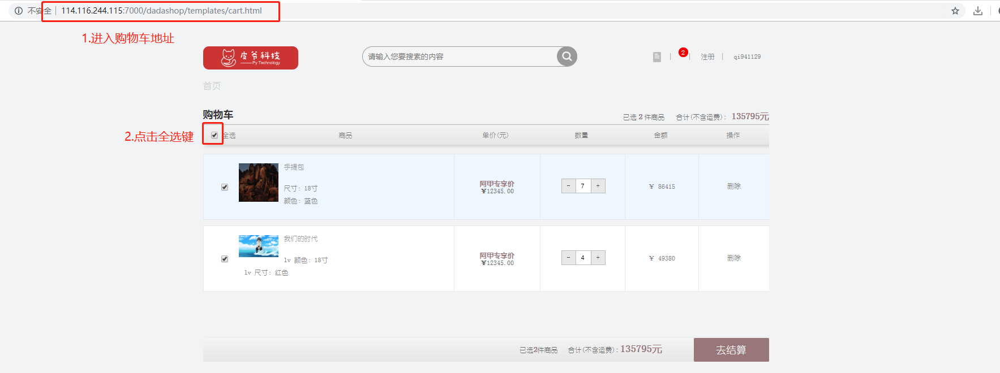

#### 触发结果

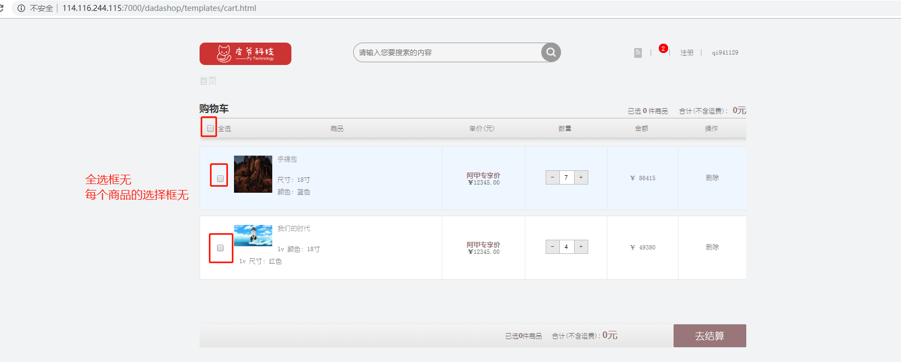

#### 前端代码

前端的代码在cart.js第332-353行。

```javascript
{  
        $(".Each input[type='checkbox']").prop("checked", false);
        $("#allcheck,#allcheck2").prop("checked", false)
        $(".susumOne,.susum").html(0);
        $(".totalOne,.total").html(0);
        $.ajax({
            url : BASE_URL+'/v1/carts/'+username,
            type : "PUT",
            dataType: "json",
            beforeSend:function (request) {
                 request.setRequestHeader('authorization',window.localStorage.getItem('dashop_token'))
             },
            data : JSON.stringify({'sku_id':sku_id,'state':'unselectall'}) ,
            success : function(result) {
            console.log(result.msg);
            if (result.dada.length == 0){
                $("#go-buy").css("background","gray")
                $("#go-buy").attr("disabled",true)                
            }
            }
        });
    }
```

**URL**： 127.0.0.1:8000/v1/carts/<username>

**请求方式**: PUT

**请求参数**：JSON

| 参数  | 类型 | 是否必须 | 说明         |
| ----- | ---- | -------- | ------------ |
| state | str  | 是       | 判断事件状态 |

```
#请求示例 
{state:'unselectall'}
```

**返回值**：JSON

**响应格式**：

```python
# 正常响应： 
{"code":200,"data":skus_list}

# 异常响应
{"code":xxx,"error"：xxxx}
```

| 字段 | 含义     | 类型 | 备注                            |
| ---- | -------- | ---- | ------------------------------- |
| code | 状态码   | int  | 默认正常为200，异常见状态码参考 |
| data | 具体数据 | dict | 与error二选一                   |
| erro | 错误信息 | char | 与data二选一                    |

skus_list参数信息

| 参数               | 类型    | 是否必须 | 说明                            |
| ------------------ | ------- | -------- | ------------------------------- |
| id                 | int     | 是       | 商品sku_id                      |
| name               | str     | 是       | 商品名称                        |
| count              | int     | 是       | 商品数量                        |
| default_image_url  | str     | 是       | 商品默认图片路径                |
| price              | decimal | 是       | 商品单价                        |
| sku_sale_attr_name | list    | 是       | 商品属性                        |
| sku_sale_attr_val  | list    | 是       | 商品属性值                      |
| selected           | int     | 是       | 商品的选中状态（0未选中,1选中） |

```python
#sku_list中数据示例 [{"id":"","name":"","count":"","selected":"","default_image_url":"","price":"","sku_sale_attr_na me":[],"sku_sale_attr_val":[]},{"":""...}]
```

状态码参考

| 状态码 | 响应信息   | 原因短语         |
| ------ | ---------- | ---------------- |
| 200    | 正常       | OK               |
| 30104  | 未找到用户 | User query error |

#### 后端代码

```python
redis_conn = get_redis_connection('cart')

class CartVIew(View):
   @logging_check
   def put(self, request, username):
        cart_dict = json.loads(request.body)
        state = cart_dict.get('state')
        user = request.user
        if user.username != username:
            return JsonResponse({'code': 30104, 'error': '非登录者用户'})
        
        
        # 判断是否全选
        if state == 'selectall' or state == 'unselectall':
            if state == 'selectall':
                skus_list = self.set_selectall_unselectall(user.id, 1)
                return JsonResponse({'code': 200, 'data': skus_list})
            
            if state == 'unselectall':
                skus_list = self.set_selectall_unselectall(user.id, 0)
                return JsonResponse({'code': 200, 'data': skus_list})           
    
    
    def set_selectall_unselectall(self, user_id, selected):
        '''
        put 请求的state 状态selectall 和 unselectall
        :param user_id: 用户id user.id
        :param selected: 状态码（0/1)
        :return: 响应列表 [{"id":"","name":"","count":"","selected":""},{"":""...}]
        '''
        cart_all = redis_conn.hgetall('cart_%d' % user_id)
        if not cart_all:
            return JsonResponse({'code': 30101, 'error': '未找到商品'})
        for sku_id in cart_all.keys():
            cart_c = redis_conn.hget('cart_%d' % user_id, sku_id)
            count = int(json.loads(cart_c)['count'])
            status = json.dumps({'count': count, 'selected': selected})
            redis_conn.hset('cart_%d' % user_id, sku_id, status)
        skus_list = self.get_cart_list(user_id)
        return skus_list

    
   def get_cart_list(self, user_id):
        '''
        :param user_id: 用户的id
        :return: reqsponse 列表 [{"id":"","name":"","count":"","selected":""},{"":""...}]
        '''
        cart_dict = {}
        # 重新去redis数据
        redis_cart = redis_conn.hgetall('cart_%d' % user_id)
        for sku_id, status in redis_cart.items():
            cart_dict[int(sku_id.decode())] = {
                'state': json.loads(status),
            }
        skus = SKU.objects.filter(id__in=cart_dict.keys())
        skus_list = []
        for sku in skus:
            sku_dict = {}
            sku_dict['id'] = sku.id
            sku_dict['name'] = sku.name
            sku_dict['count'] = int(cart_dict[sku.id]['state']['count'])
            sku_dict['selected'] = int(cart_dict[sku.id]['state']['selected'])
            sku_dict['default_image_url'] = str(sku.default_image_url)
            sku_dict['price'] = sku.price
            sku_sale_attr_name = []
            sku_sale_attr_val = []

            saleattr_vals = SaleAttrValue.objects.filter(sku_id=sku.id)
            for saleattr_val in saleattr_vals:
                #属性值
                sku_sale_attr_val.append(saleattr_val.sale_attr_value_name)
                #属性名称
                saleattrname = SPUSaleAttr.objects.filter(saleattrvalue=saleattr_val)[0]
                sku_sale_attr_name.append(saleattrname.sale_attr_name)

            sku_dict['sku_sale_attr_name'] = sku_sale_attr_name
            sku_dict['sku_sale_attr_val'] = sku_sale_attr_val
            skus_list.append(sku_dict)
        return skus_list

```

### 10.合并购物车

登陆模块会调用合并购物车函数

#### 触发事件

页面名：**cart.html** 

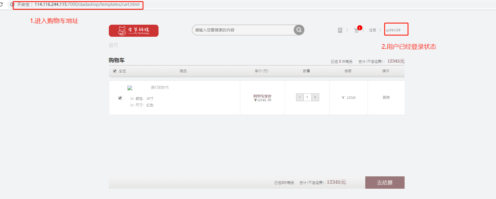

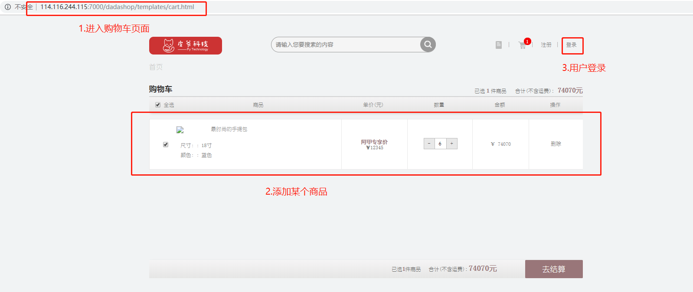

#### 触发结果

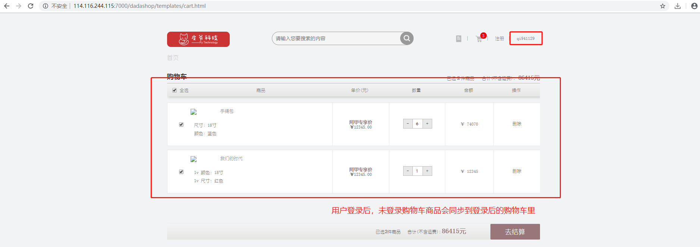

#### 前端代码

前端的代码在login.html第92-119行

```javascript
$('#bt-login').click(function () {
            //异步提交请求，进行验证
            //var verification = $(".verification_input").val();
            var username = $("#username").val();
            var password = $("#password").val();
            // 获取用户本地缓存的购物车信息
            var cart_data = JSON.parse(window.localStorage.getItem('cart'))
            var inputData = {'username':username, 'password':password,'cart':cart_data };
            if (username != '' && password != '') {
                $.ajax({
                    type: 'POST',
                    url: baseUrl+'/v1/tokens/',
                    data: JSON.stringify(inputData),
                    success: function (result) {
                        if (result.code == 200) { //登录成功
                            window.localStorage.clear()
                            window.localStorage.setItem('dashop_token', result.data.token);
                            window.localStorage.setItem('dashop_count',result.data.len);
                            window.localStorage.setItem('dashop_user', result.username);
                            alert('登录成功');
                            window.location.href = 'index.html';
                        } else { //登录失败
                            $('#showResult').html(result.error);
                        }
                    }
                });
            }
        })
```

**请求参数**：JSON

| 参数   | 类型 | 是否必须 | 说明     |
| ------ | ---- | -------- | -------- |
| sku_id | str  | 是       | 商品id   |
| count  | int  | 是       | 商品数量 |

**响应格式**：

```json

{'code': 200, 'username': user.username, 'data': {'token': token.decode(),'len':cart_len}}
```

| 字段     | 含义     | 类型 | 备注          |
| -------- | -------- | ---- | ------------- |
| code     | 状态码   | int  | 默认正常为200 |
| username | 用户名   | char | 必选          |
| data     | 具体数据 | dict | 必选          |

参数信息

| 参数     | 类型 | 是否必须 | 说明             |
| -------- | ---- | -------- | ---------------- |
| token    | char | 是       | token令牌        |
| len      | int  | 是       | 购物车里数据长度 |
| username | char | 是       | 用户名           |

状态码参考

| 状态码 | 响应信息 | 原因短语 |
| ------ | -------- | -------- |
| 200    | 正常     | OK       |

#### 后端代码

```python
def merge_cart(user,token,cart_data):
    cart_cookie = cart_data
    user = user
    #判断如果未登录购物车为空
    if not cart_cookie:
        cart_dict = get_redis_connection('cart')
        cart_len = cart_dict.hlen('cart_%d' % user.id)
        response = {'code': 200, 'username': user.username, 'data': {'token': token.decode(), 'len': cart_len}}
        return JsonResponse(response)

    for c_dic in cart_cookie:
        sku_id= c_dic['id']
        c_count = int(c_dic['count'])
        redis_cli = get_redis_connection('cart')
        skuid = redis_cli.hgetall('cart_%d'%user.id)
        if sku_id.encode() in skuid.keys():
            status = redis_cli.hget('cart_%d'%user.id,sku_id)
            count = int(json.loads(status.decode())['count'])
            count = max(c_count,count)
            status = json.dumps({'count':count,'selected':1})
            redis_cli.hset('cart_%d' % user.id, sku_id,status)
        else:
            status = json.dumps({'count':c_count, 'selected': 1})
            redis_cli.hset('cart_%d' % user.id, sku_id, status)

    cart_dict = get_redis_connection('cart')
    cart_len = cart_dict.hlen('cart_%d' % user.id)
    response = {'code': 200, 'username': user.username, 'data': {'token': token.decode(),'len':cart_len}}
    # 返回响应对象，最终返回给浏览器
    return JsonResponse(response)
```

