# Jenkins


## 一、介绍

Jenkins是一个开源软件项目，是基于Java开发的一种持续集成工具，可视化管理服务器持续构建，可以直接去svn或者git上拉取代码并下发到服务器上 。


## 二、功能

1、持续的软件版本发布/测试项目。

2、监控外部调用执行的工作。


## 三、部署操作

1.准备包：

**jdk-8u171-linux-x64.tar.gz **

**apache-tomcat-9.0.12.tar.gz**

**jenkins.war**


2.服务器部署过程

```
下载完的jdk二进制包解压

[root@qi ~]# tar xf jdk-8u171-linux-x64.tar.gz -C /usr/local/

 

给jdk做个软链接

[root@qi ~]# ln -s /usr/local/jdk1.8.0_171 /usr/local/jdk

 

配置Java环境变量

[root@qi ~]# sed -i.ori '$a export JAVA_HOME=/usr/local/jdk\nexport PATH=$JAVA_HOME/bin:$JAVA_HOME/jre/bin:$PATH\nexport CLASSPATH=.$CLASSPATH:$JAVA_HOME/lib:$JAVA_HOME/lib/tools.jar' /etc/profile

 

让java环境变量立刻生效

[root@qi ~]# source /etc/profile

 

检查java命令

[root@qi ~]# which java

 


解压安装tomcat

[root@qi ~]# tar xf apache-tomcat-9.0.5.tar.gz -C /usr/local/

 

给tomcat做软链接

[root@qi ~]#ln -s /usr/local/apache-tomcat-9.0.12/ /usr/local/tomcat

 

配置tomcat环境变量

[root@qi ~]# echo 'export TOMCAT_HOME=/usr/local/tomcat' >> /etc/profile

 

立即生效

[root@qi ~]# source /etc/profile

 

对jdk及Tomcat安装目录递归授权root

[root@qi local]# chown -R root.root /usr/local/jdk/ /usr/local/tomcat


将jenkins.war移动到tomcat的webapps下

[root@qi ~]# mv  jenkins.war /usr/local/tomcat/webapps


启动jenkins

[root@qi ~]# cd  /usr/local/tomcat/webapps

[root@qi webapps]# nohup java -jar jenkins.war &> /tmp/jenkins.out 

INFO: Jenkins is fully up and running 启动成功

```


## 四、jenkins设置


```
http://ip:8080

```


```
服务器端打开文件 cat /root/.jenkins/secrets/initialAdminPassword
```

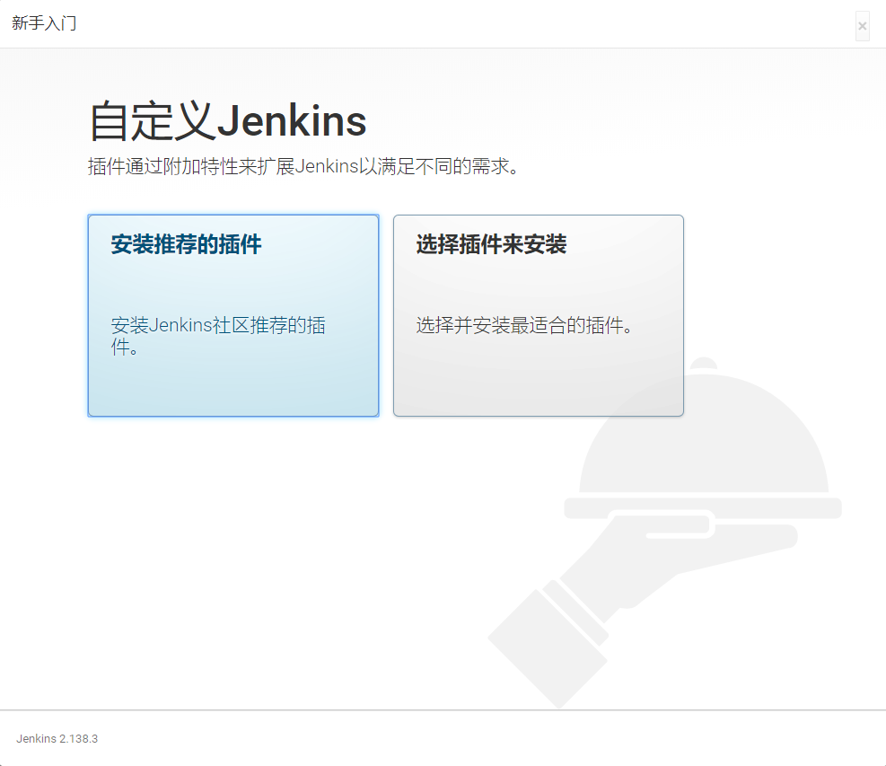

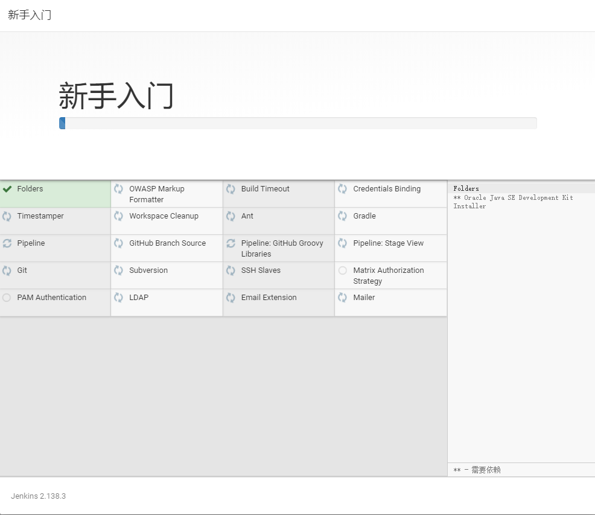

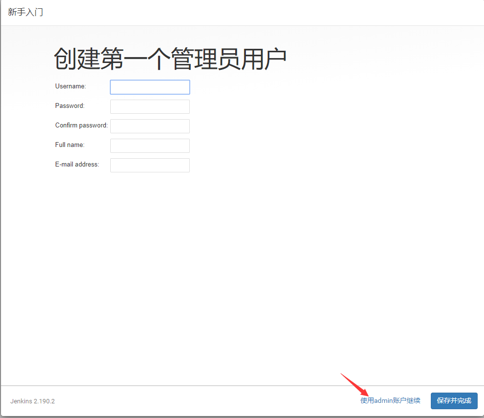

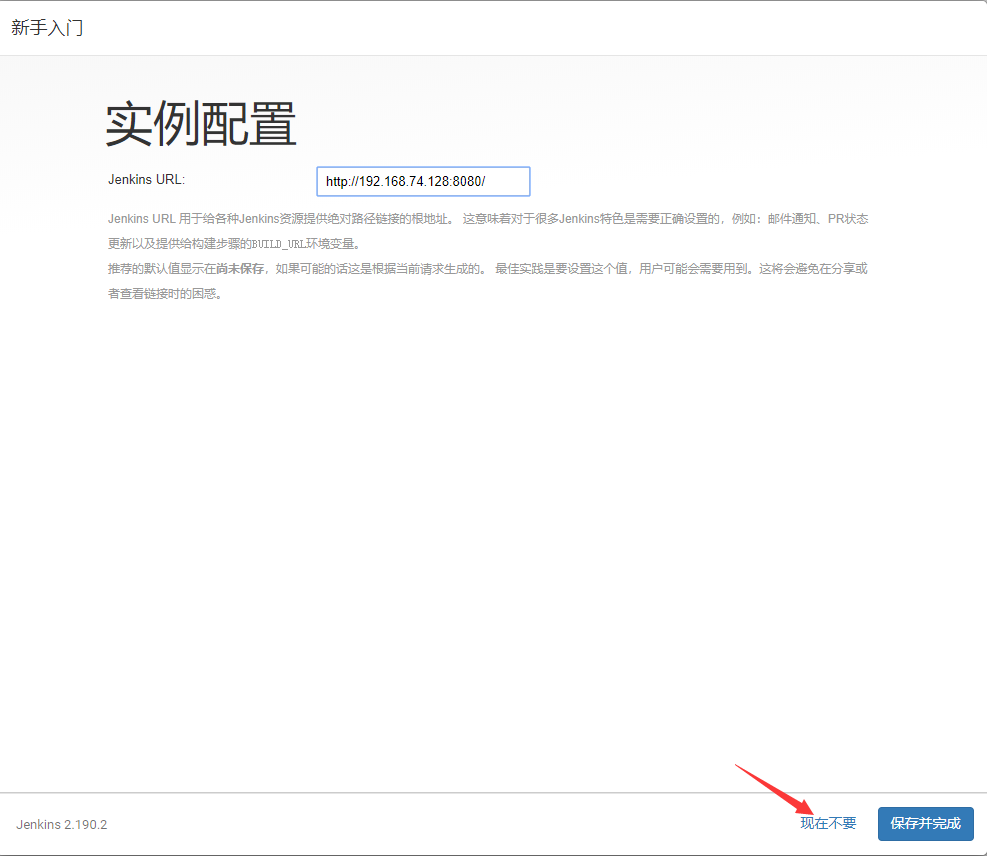

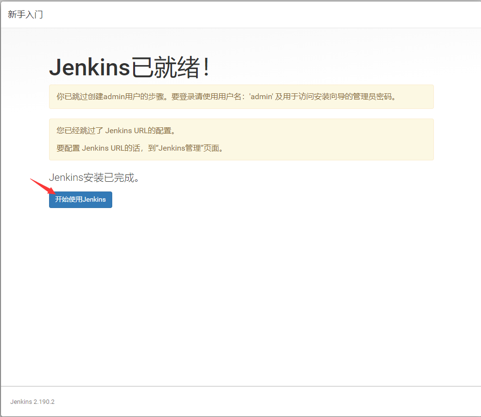

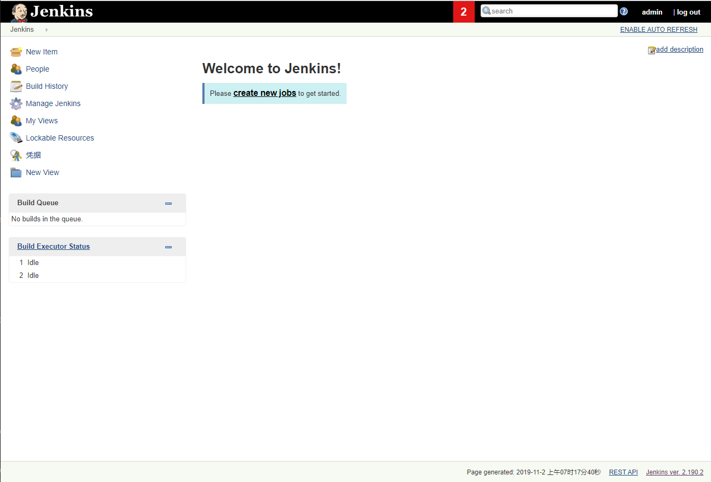


```
修改密码
```

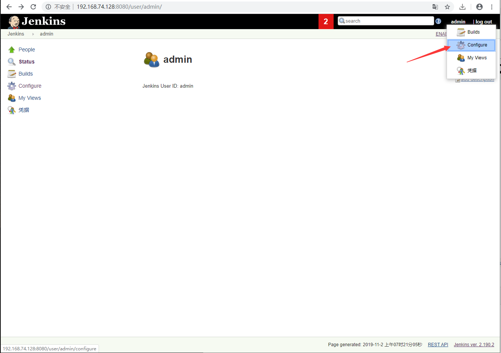


```
创建一个新的工作项目
```

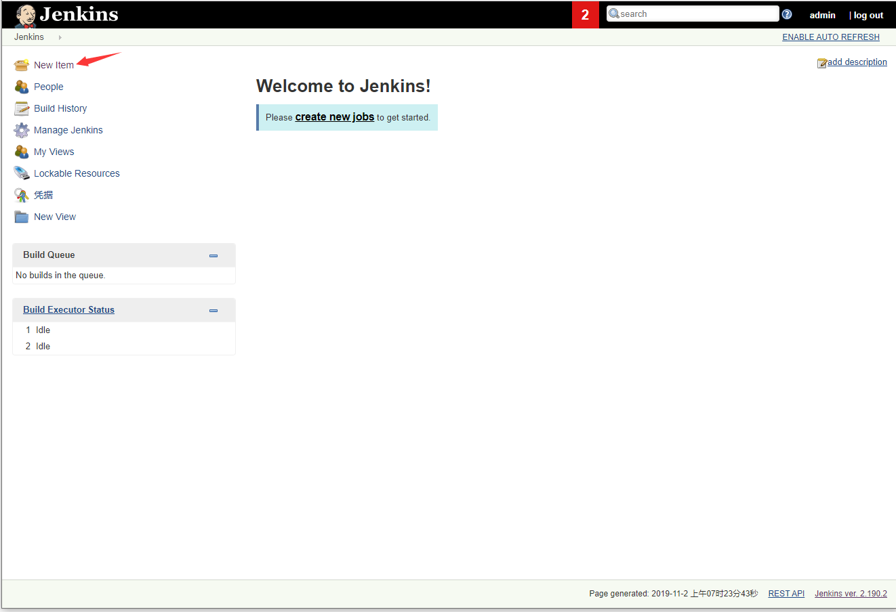

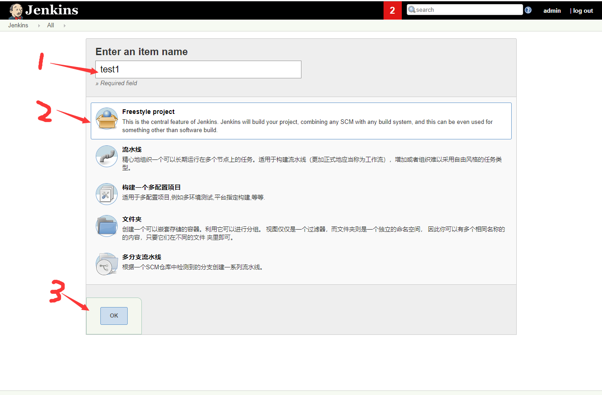

```
设置log过期时间
```

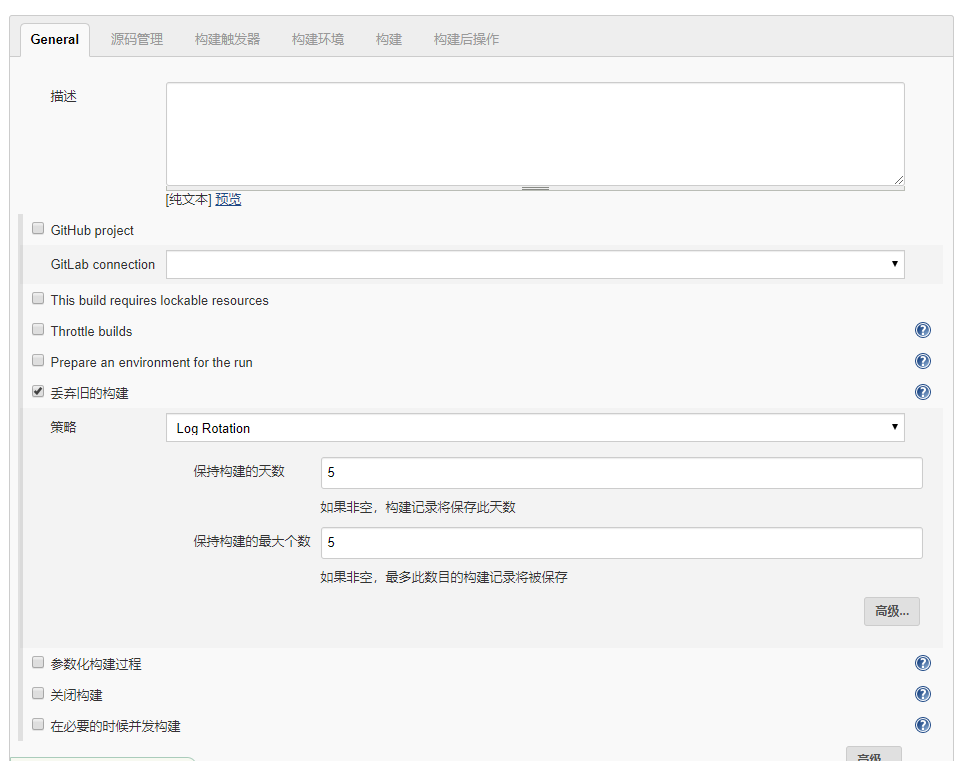

```
按照每1小时拉取代码
```

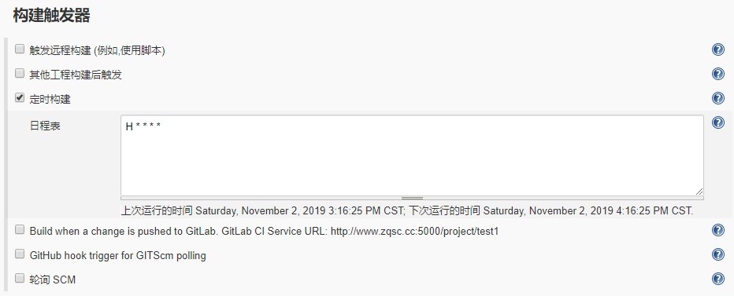

```
构建填写shell脚本
```

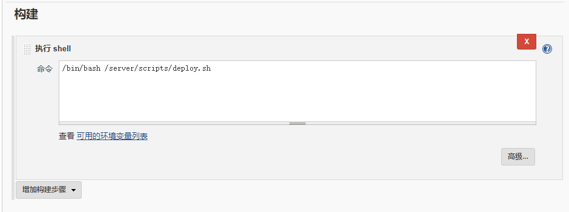


## 五、Shell脚本

```shell
创建自动化jenkins脚本
cat deploy.sh


#!/bin/sh
#author qsk
#该文件需要在使用之前创建/web-code & /web
CODE_DIR="/web-code"
TIME=`date +%F-%H-%M-%S`
uwsgi_dir_pid="/tedu/dadashop/dadashop/uwsgi.ini"
#IP=

GET_CODE(){
        cd $CODE_DIR
        git clone -b developer git@code.aliyun.com:dadashop/dashop.git

}
TAR_CODE(){
        cd $CODE_DIR && tar zcf /mnt/web-${TIME}.tar.gz ./* && rm -rf $CODE_DIR/*

}
CP_CODE(){
        mkdir /web/web-$TIME
        cp /mnt/web-${TIME}.tar.gz /web/web-$TIME

}
XF_CODE(){
        cd /web/web-$TIME && tar xf web-${TIME}.tar.gz && rm -rf web-${TIME}.tar.gz

}

main(){
        GET_CODE
        TAR_CODE
        CP_CODE
        XF_CODE
}
main

cp -rf /web/web-$TIME/dashop/* /tedu/dadashop
sed -i 's#baseUrl="http://127.0.0.1:8000"#//baseUrl="http://127.0.0.1:8000"#' /tedu/dadashop/static/js/init.js
sed -i 's#//baseUrl="http://114.116.244.115:7000#baseUrl="http://114.116.244.115:7001#' /tedu/dadashop/static/js/init.js
rm -fr /tedu/dadashop/django_static
python3 /tedu/dadashop/manage.py collectstatic


```


### 六、手动构建

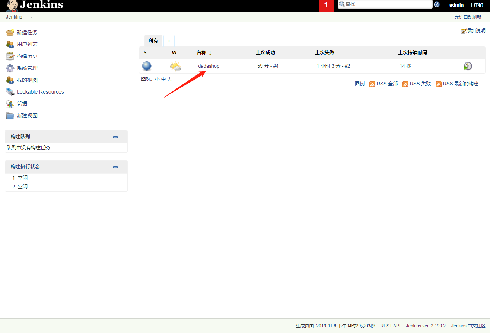

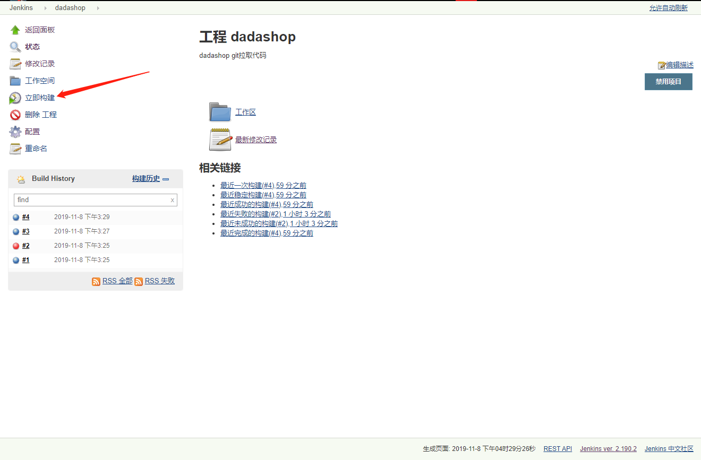


