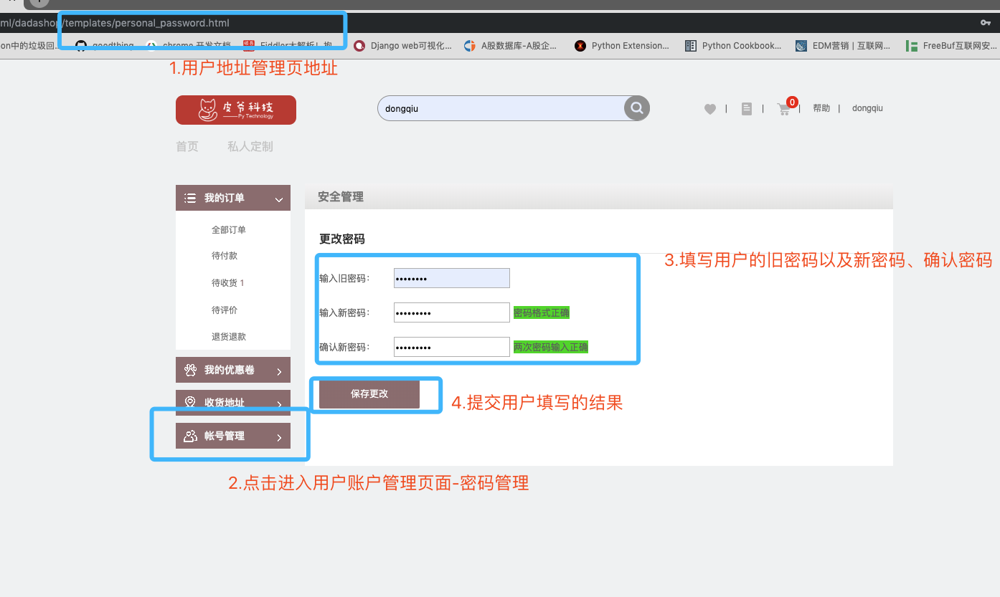
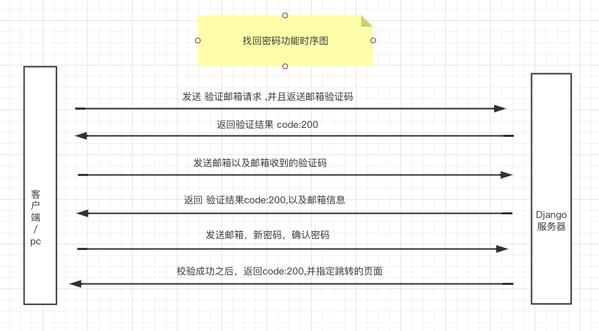
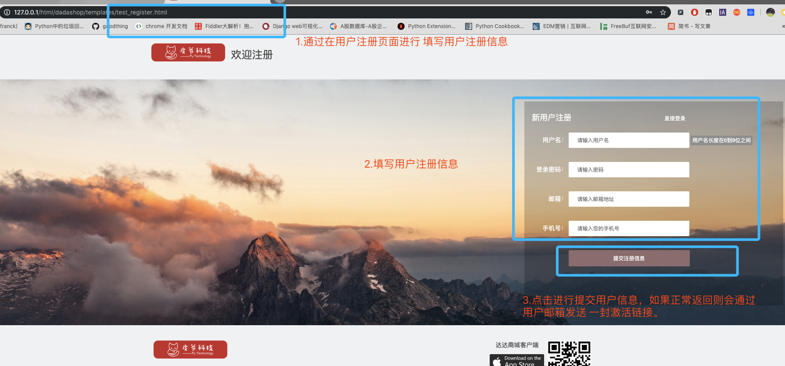
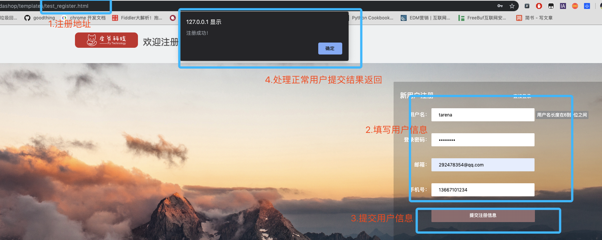
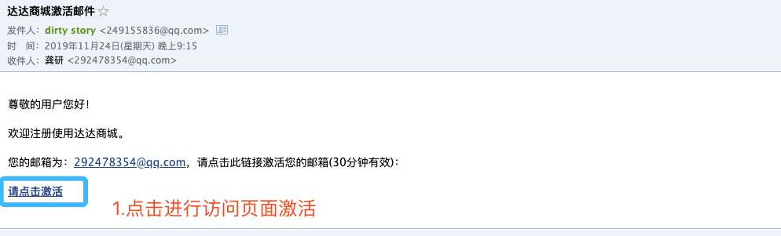
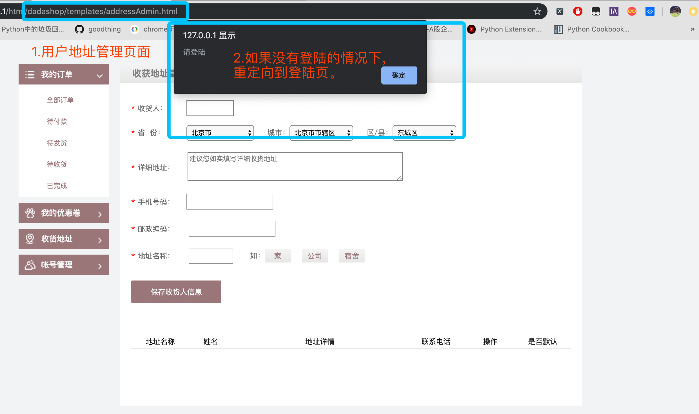

# 用户模块-接口说明

# 一.用户模块概述：	

​		用户模块主要提供对于是用户使用本产品的基础。用户模块提供以下功能：

>找回密码
>
>修改密码
>
>用户激活
>
>用户收获地址新增/修改/删除/设为默认
>

# 二.事件定义

## 找回密码

​		用户在登陆页可以通过点击找回密码按钮来实现找回密码功能，主要分为三步。首先通过用户发送注册时的邮箱，此时会向邮箱中发送一份关于找回密码的验证码，此验证码会有时效。通过输入对应的验证码，验证校验通过之后，显示设置新密码界面，提交之后就可以使用新密码进行登录。

##修改密码

​		修改密码功能需要在登录情况下进行，在个人账号管理页面中选择，需要输入旧密码以及新密码。通过ajax进行与后端交互。如果用户正确修改密码之后，则需要重新登陆。

## 用户激活

​		用户在注册的同时会同步发送用户激活的邮件。此激活邮件中存在用户激活的链接，用户通过点击此链接之后，在此页面内进行跳转到激活页面，此页面中有两个按钮，是否激活。用户点击激活之后，通过ajax发送激活请求。进行激活。

##用户地址

​	地址查询功能：在用户访问到地址页面时，此时会发送用户绑定的地址请求，全量返回有效的用户地址。

​	增加地址功能：用户可以提交新增地址，包括收货人、收件地址、地址标签、以及用户的联系方式，通过ajax提交。如果正常存储的话，此时回全量返回用户绑定的地址。

​	修改地址功能：用户可以修改有效地址中的收件人、收件地址、练习方式、以及地址标签。提交成功的话，回全量返回用户的地址。

​	删除地址功能：用户可以在界面上触发删除地址按钮，此时会将地址的ID通过ajax传入到后台，通过设置该地址的活跃属性来实现删除功能，此功能也是全量返回，然后通过渲染进行在前端展示。

​	设为默认地址：用户可以将任意一个非默认地址改为默认地址。通过ajax提交到后端，此功能提交的是地址的ID，将此ID的地址设置为默认，同时将此用户的其他地址ID设为非默认。然后进行全量返回。进行渲染。

# 三.API 说明

## 修改密码

 在登录的状态下才能够修改用户登录密码。

#### 事件触发：

页面名： **personal_password.html**



#### 触发结果：

​	触发成功：


​	触发失败：


#### 前端代码：

前端的html为personal_password.hml，在第97-115行有用户输入框的定义。

```javascript
// 具体的js请求代码如下具体代码见personal_password.html第164-190行。

var username= window.localStorage.getItem('dashop_user')
    $(".save_password").click(function () {
	if ($('#npwd').val()==$('#rpwd').val()) {
		$.ajax({
			type: 'post',
            url: baseUrl+'/v1/users/'+username+'/password',
            contentType:'application/json',
			datatype: 'json',
			data: JSON.stringify({"oldpassword": $('#upwd').val(),"password1": $('#npwd').val(),"password2":$('#rpwd').val()}),
            beforeSend:function(request){
				request.setRequestHeader("authorization",localStorage.getItem('dashop_token'))
			},
            success: function (response) {
				if (response.code==200) {
					alert('密码修改成功')
					$('#upwd').val('')
					$('#npwd').val('')
          $('#rpwd').val('')
          window.localStorage.clear()
          location.href = 'login.html'
				}else{
               alert(response.error)
              }
			},
		})
	} else {
		alert("请再次验证输入密码是否一致！");
	}
})
```

####修改密码API：

**URL**: `http://127.0.0.1:8000/v1/users/<username>/password`

**请求方法**：POST

**请求参数**：JSON

| 字段        | 含义     | 类型 | 备注 |
| ----------- | -------- | ---- | ---- |
| oldpassword | 旧密码   | char | 必填 |
| password1   | 新密码   | char | 必填 |
| password2   | 确认密码 | char | 必填 |

请求示例：

```json
{
  'oldpasword':'123456',
  'password1':'123321',
  'password2':'654321'
}
```

| 字段  | 含义     | 类型 | 备注                      |
| ----- | -------- | ---- | ------------------------- |
| code  | 状态     | int  | 默认正常为200。异常见附录 |
| error | 错误信息 | dict | 与data二选一              |
| data  | 正确信息 | dict | 与error二选一             |

**返回值**：JSON

**响应格式**：

```json
# 正确示例
{
  'code':200,
  'data':'修改成功'
}
# 错误示例
{
  'code':xxx,
  'error':'error reason'
}

```

#### 后端代码

```python
# BaseUserView 是一个公共调用的基础试图。里边封装的两个方法。

import hashlib
import random
import base64
import json

from urllib.parse import unquote
from celery_tasks.user_tasks import send_verify
from .models import UserProfile, Address, WeiboUser
from django_redis import get_redis_connection
from django.views.generic import View
from django.http import JsonResponse
from django.db import transaction
from django.conf import settings
from dtoken.views import make_token
from .weiboapi import OAuthWeibo
from utils.loging_decorator import logging_check

# Create your views here.


class BaseUserView(View):
    """
    此类是用来公共调用，有两个功能：
    1.获取生成用户地址列表
    2.检查传递的参数
    """
    def get_address_list(self,alladdress):
        """
        对用户的地址进行序列化
        params : 返回所有地址query_set,进行遍历
        return : 地址列表，元素为每一条合法的地址
        """
        addresslist = []
        for values in alladdress:
            each_address = {}
            each_address['id'] = values.id
            each_address['address'] = values.address
            each_address['receiver'] = values.receiver
            each_address['receiver_mobile'] = values.receiver_mobile
            each_address['tag'] = values.tag
            each_address['is_default'] = values.default_address
            addresslist.append(each_address)
        return addresslist

    def check_args(self,data):
        """
        用来检查用户传递的数据。是否为空。
        params : 前端传递的数据，格式为字典。
        return : 返回检查之后的数据
        """
        for key,value in data.items():
            if not value:
                return key
        return data
      
class ModifyPasswordView(BaseUserView):
    """
    用户登陆状态下 修改密码：
    http://127.0.0.1:8000/v1/user/<username>/password
    """
    @logging_check
    def post(self, request, username):
        """
        :param request:请求对象
        :return:返回修改密码之后的状态，
        """
        data = json.loads(request.body)
        if len(data) != 3:
            return JsonResponse({'code': 10123, 'error': 'Missing parameters'})
        checked_data = self.check_args(data)
        if type(checked_data) == str:
            return JsonResponse({'code': 10123, 'error': 'Missing %s parameters'%checked_data}) 
        oldpassword = data.get('oldpassword')
        password1 = data.get('password1')
        password2 = data.get('password2')
        if oldpassword == password1 or oldpassword == password2:
            return JsonResponse({'code': 10109, 'error': 'Please Use Different Password!'})
        # 判断两次密码是否一致
        if password1 != password2:
            return JsonResponse({'code': 10102, 'error': 'Inconsistent passwords!'})
        user = request.user
        real_password = user.password
        m = hashlib.md5()
        m.update(oldpassword.encode())
        if m.hexdigest() != real_password:
            return JsonResponse({'code': 10103, 'error': 'Old password error!'})
        new = hashlib.md5()
        new.update(password1.encode())
        user.password = new.hexdigest()
        user.save()
        return JsonResponse({'code': 200, 'data': 'OK'})
```

## 找回密码功能

**时序图**



###step1 发送邮箱验证请求：

#### 事件触发：

页面名： **findPass.html**


#### 触发结果：

邮箱中可以收到后台发送的邮箱验证码（10分钟之内有效）：


触发失败：


#### 前端代码：

```javascript
  $btn.on("click", function () {
        if ($email.val() != "") {
            //发送数据
            $.ajax({
                url: baseUrl+'/v1/users/password/sms',
                type: 'POST',
                data: JSON.stringify({
                    "email": $email.val()
                }),
                contentType:'application/json',
                dataType: "json",
                success: function (d) {
                    console.log(d)
                    if (d.code == 200) {
                        $pitem2.show();
                        $btn.hide();
                        $btn2.show();
                    }else{
                      alert(d.error)
                    }
                }
            })
        }
    })
```

发送邮箱验证

**URL**：`http://127.0.0.1:8000/v1/users/password/sms`

**请求方法**：POST

**请求参数**：JSON

| 字段  | 含义 | 类型 | 备注             |
| ----- | ---- | ---- | ---------------- |
| email | 邮箱 | char | 通过邮箱找回密码 |

请求示例：

```json
{
	'email':xxxxx # 邮箱
}
```

响应数据

| 字段  | 含义         | 类型 | 备注          |
| ----- | ------------ | ---- | ------------- |
| code  | 状态吗       | int  | 必填          |
| data  | 返回数据     | dict | 与error二选一 |
| error | 返回错误原因 | char | 与data二选一  |

**返回值**：JSON

**响应格式**：

```json
# 正常响应
{
  'code':200,
  'data':"邮件发送成功",
}

# 异常响应
{
  'code':xxx,
  'error':'error reason'
}
```

#### 后端代码：

```python
class SendSmsCodeView(BaseUserView):
    """
    用户找回密码视图处理函数：
    分为三步：
    1.验证邮箱，并且发送邮件验证码
    2.验证邮件验证码，
    3.验证码验证成功，修改密码
    """

    def post(self, request):
        data = json.loads(request.body)
        if len(data) != 1:
            return JsonResponse({'code': 10123, 'error':'Missing parameters'})
        check_data = self.check_args(data)
        if type(check_data) == str:
            return JsonResponse({'code': 10123, 'error': 'Missing %s parameters'%checked_data}) 
        # 验证用户是否是已经注册用户
        email = data.get('email')
        try:
            user = UserProfile.objects.get(email=email)
        except Exception as e:
            return JsonResponse({'code': 10104, 'error':'User query error'})
        # 先去查询该用户是否在时效时间内发送过验证码
        redis_conn = get_redis_connection('verify_email')
        try:
            email_code = redis_conn.get('email_code_%s'%email)
        except Exception as e:
            return JsonResponse({'code': 10132, 'error': 'Verify Code Error'})
        if email_code:
            return JsonResponse({'code': 202, 'error': 'please enter your code!'})

        email_code = "%06d" % random.randint(0, 999999)
        try:
            redis_conn.setex("email_code_%s" % email, 10 * 60, email_code)
        except Exception as e:
            return JsonResponse({'code': 10105, 'error': 'Storage authentication code failed'})
        send_verify.delay(email=email, email_code=email_code, sendtype=0)
        return JsonResponse({'code': 200, 'data':'OK'})
```

### step2: 发送邮箱验证码

#### 事件触发：

页面名： **findPass.html**


#### 触发结果：

正常结果：


异常结果：


#### 前端代码：

```javascript
// 前端代码中获取用户输入值，进行提交 具体代码见 findPass.js 第40行到66行
$btn2.on("click", function () {
        if ($email.val() != "" && $code.val() != "") {
            //发送数据
            $.ajax({
                type: 'POST',
                data: JSON.stringify({
                    "email": $email.val(),
                    "code": $code.val()
                }),
                url: baseUrl+'/v1/users/password/verification',
                dataType: "json",
                contentType:'application/json',
                success: function (d) {
                    if (d.code == 200) {
                        $pitem.hide();
                        $pitem2.hide();
                        $pitem3.show();
                        $pitem4.show();
                        $btn2.hide();
                        $btn3.show();
                    }else{
                      alert(d.error)
                    }
                }
            })
        }
    })
```

发送邮箱验证码：

**URL**：`http://127.0.01:8000/v1/users/password/verification`

**请求方法**： POST

**请求参数**：JSON

| 字段  | 含义   | 类型 | 备注 |
| ----- | ------ | ---- | ---- |
| email | 邮箱   | char | 必填 |
| code  | 验证码 | char | 必填 |

```json
{
  'email':'xxxx',
  'code':'xxxx'
}
```

响应数据：

| 字段  | 含义           | 类型 | 备注          |
| ----- | -------------- | ---- | ------------- |
| code  | 响应状态吗     | char | 必填          |
| data  | 返回正常数据() | dict | 与error二选一 |
| error | 返回错误原因() | char | 与data二选一  |

**返回值**：JSON

**响应格式**：

```json
# 正常响应
{
  'code':200,
 	'data':'验证码通过'，
  'email’：‘xxxx’ # 返回邮箱
}

# 异常响应
{
  'code':xxx,
  'error':'error reason'
}
```

#### 后端代码：

```python
class VerifyCodeView(BaseUserView):
    """
    第二步 验证发送邮箱的验证码
    """
    def post(self, request):
        """
        验证用户邮箱验证码
        :param request:
        :param username: 用户名
        :return:
        """
        data = json.loads(request.body)
        if len(data) != 2:
            return JsonResponse({'code': 10123, 'error': 'Missing parameters'})
        checked_data = self.check_args(data)
        if type(checked_data) == str:
            return JsonResponse({'code': 10123, 'error': 'Missing %s parameters'%checked_data}) 
        email = data.get('email')
        code = data.get('code')
        # 验证用户是否匹配
        redis_conn = get_redis_connection('verify_email')
        try:
            email_code = redis_conn.get('email_code_%s' % email)
        except Exception as e:
            return JsonResponse({'code': 10106,'error': 'invalid validation. Resend it.'})
        redis_code = email_code.decode()
        print(redis_code)
        if redis_code == code:
            return JsonResponse({'code': 200, 'data': '验证码通过！', 'email': email})
        return JsonResponse({'code': 10124, 'error':'code is wrong!'}) 
```

### step3 修改密码

#### 事件触发：

页面名： **findPass.html**


#### 触发结果：

正常响应


异常响应：


#### 前端代码

```javascript
// 详情见 findPass.js 中第67-97行
$btn3.on("click", function () {
        if ($newpass.val() != "" && $repass.val() != "") {
            //发送数据
            $.ajax({
                type: 'POST',
                data: JSON.stringify({
                    "password1": $newpass.val(),
                    "password2": $repass.val(),
                    "email": $email.val()
                }),
                url: baseUrl+'/v1/users/password/new',
                contentType:'application/json',
                dataType: "json",
                success: function (d) {
                    if (d.code == 200) {
                        alert('密码修改成功')    
                        window.location.href='login.html'
                    }else{
                      alert(d.error)
                    }
                }
            })
        }
    })
```

修改密码：

**URL**：`http://127.0.0.1:8000/v1/users/password/new`

**请求方法**：POST

**请求参数**：JSON

| 字段      | 含义     | 类型 | 备注 |
| --------- | -------- | ---- | ---- |
| email     | 邮箱     | char | 必填 |
| password1 | 新密码   | char | 必填 |
| Password2 | 确认密码 | char | 必填 |

请求i示例

```json
{
	"email":"xxx",    # 通过用户邮箱锁定用户
  'password1':'xxx' # 新密码
  'password2':'xxx' # 确认密码
}
```

响应数据：

| 字段  | 含义         | 类型 | 备注          |
| ----- | ------------ | ---- | ------------- |
| code  | 响应状态码   | char | 必填          |
| data  | 返回正常数据 | dict | 与error二选一 |
| error | 返回异常数据 | dict | 与data二选一  |

**返回值**：JSON

**响应格式**：

```json
# 正常数据
{
  'code':200,
  'data':'OK'
}
#  异常数据
{
  'code':xxx,
  'error':'error reason'
}
```

#### 后端代码：

```python
class ModifyPwdView(BaseUserView):
    """
    最后一步验证邮箱，修改密码
    """

    def post(self, request):
        data = json.loads(request.body)
        if len(data) != 3:
            return JsonResponse({'code': 10123, 'error': 'Missing parameters'})
        checked_data = self.check_args(data)
        if type(checked_data) == str:
            return JsonResponse({'code': 10123, 'error': 'Missing %s parameters'%checked_data}) 
        password1 = data.get('password1')
        password2 = data.get('password2')
        email = data.get('email')
        if password1 != password2:
            return JsonResponse({'code': 10110, 'error': 'Password Inconsistencies!'})
        try:
            user = UserProfile.objects.get(email=email)
        except Exception as e:
            return JsonResponse({'code': 10104, 'error': 'User query error!'})
        # 读取旧密码
        new = hashlib.md5()
        new.update(password1.encode())
        user.password = new.hexdigest()
        user.save()
        return JsonResponse({'code': 200, 'data': 'OK'})
```

## 邮箱验证激活功能

​		在用户注册时候，后台会给用户注册填写的邮箱发送一条激活的链接。通过点击链接跳转到达达商城的用户激活页面。通过激活来实现商城所有功能的体验。

#### 事件触发：

用户在注册时候会通过邮箱给用户发送一封激活邮件，然后用户通过点击链接，进行重定向到前端地址，此时通过js获取用户前端页面的查询字符串，进行激活。

页面名： **test_register.html**



#### 触发结果

正常结果：






异常结果：


#### 前端代码

前端的激活链接如上图所示，通过点击是否激活按钮。点击按钮之后，前端页面的js代码会获取激活链接参数，将其拼接到后端路由。

```javascript
# active.html 页面中的90-108行
<script>
    var url_params = location.search
    var isBtn = document.getElementsByClassName('active_true')[0];
    isBtn.onclick=function(){
        $.ajax({
                url: baseUrl+'/v1/users/activation'+url_params,
                type: 'get',
                dataType: "json",
                success: function (d) {
                    if (d.code == 200) {
                        alert('激活成功！')
                        window.location.href="index.html"
                    }else{
                      alert(d.error)
                    }
                }
            })
    }
</script>
```

**URL**：`http://127.0.0.1:8000/v1/users/activation?code=xxxx`

**请求方法**：GET

**请求参数**：JSON

| 字段 | 含义                         | 类型 | 备注 |
| ---- | ---------------------------- | ---- | ---- |
| code | 用户名和密码base64编码字符串 | char | 必填 |

**返回值**：JSON

**响应格式**：

```json
# 正常响应
{
  'code': 200,
  'data': '激活成功'
}

# 异常响应
{
  'code':xxx,
  'error':'error_reason'
}
```

#### 后端代码

```python
class ActiveView(View):
    """
    # 用户发送邮件激活
    # GET http://127.0.0.1:8000/v1/user/active?code=xxxxx
    """
    def get(self, request):
        """
        由于没有设置激活链接的参数的redis中的有效时间。
        在用户激活之后删除redis中缓存的激活链接
        """
        code = request.GET.get('code', None)
        if not code:
            return JsonResponse({'code': 10113, 'error':'Error activating link parameters'})
        # 反解激活验证链接
        verify_code = base64.urlsafe_b64decode(code.encode('utf-8')).decode()
        random_code, username = verify_code.split('/')
        redis_conn = get_redis_connection('verify_email')
        result = redis_conn.get('email_active_%s' % email).decode()
        if not result:
            return JsonResponse({'code': 10112, 'error': 'Link is invalid and resend it!'})
        # 验证前端传来的激活链接和redis中是否一致
        if code != result:
            return JsonResponse({'code': 10112, 'error': 'Link is invalid and resend it!'})
        user = request.user
        user_email = user.email
        # 判断code中的用户信息和数据库中信息是否一致
        if user_email != email:
            return JsonResponse({'code': 10112, 'error': 'Link is invalid and resend it!'})
        user.isActive = True
        user.save()
        redis_conn.delete('email_active_%s'%email)
        return JsonResponse({'code': 200, 'data': 'OK'})

```

## 地址功能-增删改查设为默认

达达商城提供地址增删改察设为默认的功能：

​	查询功能：在用户请求的地址管理页面的时候，等页面主体加载完之后，会发送查询当前用户的绑定地址。返回当前用户绑定的所有地址。

​	增加地址功能：用户可以新增绑定地址。

​	修改地址功能：可以修改用户地址中的任何字段。

​	删除地址功能：可以删除用户所绑定的地址，不是真正的删除，而是在后台将地址改为非活跃的。

​	设为默认地址：用户可以将任意一个非默认地址改为默认地址。默认地址在用户完成付款之前会直接绑定到该订单上。


### 查询地址：

**URL**:`http://127.0.0.1:8000/v1/users/<username>address`

#### 事件触发：

页面名：**addressAdmin.html**


#### 触发结果：

​	正常响应：


​	异常响应：

​	如果用户没有登陆的访问到地址页面，此时会弹出用户登陆提示，然后跳到登陆页面。



#### 前端代码：

```javascript
// 代码地址为addressAdmin.html中的201-231行
function loadUserList(){
		$.ajax({
			url:baseUrl+'/v1/users/'+username+'/address',
			type:'get',
			beforeSend:function(request){
				request.setRequestHeader("authorization",localStorage.getItem('dashop_token'))
			},
			success(data){
				// console.log(data);
				if(data.code==200){
					var userList=data.addresslist;
					// console.log(userList);
					$(".aim_content_one").remove();
					let html="";
					for(var ul of userList){
						// console.log(ul);
						html+=`
						<div class="aim_content_one ${ul.is_default?'aim_active':''}" data-id="${ul.is_default?1:''}">
						<span class="dzmc dzmc_active">${ul.tag}</span>
						<span class="dzxm dzxm_normal">${ul.receiver}</span>
						<span class="dzxq dzxq_normal">${ul.address}</span>
						<span class="lxdh lxdh_normal">${ul.receiver_mobile}</span>
						<span class="operation operation_normal">
							<span class="aco_change" data-uid="${ul.id}">修改</span>|<span class="aco_delete" data-uid="${ul.id}">删除</span>
						</span>
						<span class="swmr swmr_normal" data-uid="${ul.id}">${ul.is_default?"":"设置默认"}</span>
					</div>
						`
					}
					$(".address_information_manage").append(html);
					//删除的事件
					$(".aco_delete").click(function(){
						var id=$(this).data("uid");
						// console.log(id);
						del(id);
					})
					//更新的事件
					$(".aco_change").click(function(){
						var id=$(this).data("uid");
						updateUser(this,id)
					})
					//设置默认的点击时间
					$(".swmr").click(function(){
						// console.log($(this).data("uid"));
						var uid=$(this).data("uid");
						setDefaults(uid);
					})
				}else{
					alert(data.error)
				}
			}
		})
	}
```

**请求方法**：GET

返回数据：在访问页面的时候，返回当前用户的所有地址

**返回值**：JSON

**响应格式**：

```json
# 正常数据返回
{
  "code":200,
   "addresslist":[
      {
        'id':123456, # 地址id
        'address':'广东省深圳市龙华区嘉熙业广场1155室'， # 地址
        'receiver’：’达内科技‘， # 收货人
        'receiver_mobile‘：'12345678901', # 联系电话
        'tag':'家'，# 地址标签
        'postcode':'722494',  #
        'is_default':"True",
      },
      {
         'id':123457,
        'address':'广东省深圳市龙华区嘉熙业广场1142室'，
        'receiver’：’达内科技‘，
        'receiver_mobile‘：'12345678910',
        'tag':'公司'，
        'postcode':'722406',
        'is_default':"False",
      }
    ]
}
# 异常数据返回类型：
{
  'code': status_code,
  'error':'error_reason'
}
```

#### 后端代码：

```python
class AddressView(BaseUserView):
    """
    get: 获取用户的绑定的收获地址
    post: 新增用户绑定的收获地址
    delete：实现用户删除地址功能
    put: 实现用户修改地址功能
    """
    @logging_check
    def get(self, request, username):
        """
        返回用户关联的地址页面，以及地址
        :param request:
        :return: addressAdmin.html & addresslist
        """
        user = request.user
        # 获取用户的id
        userId = user.id
        # 返回当前用户所有地址，
        try:
            all_address = Address.objects.filter(uid=userId, is_alive=True)
            # 获取用户地址，然后用json的地址返回查询后根据querySet 返回相应的字符串。
        except Address.DoesNotExist as e:
            return JsonResponse({'code': 10114, 'error': 'Error in Address Query!'})
        addresslist = self.get_address_list(all_address)
        result = {
            'code': 200,
            'addresslist': addresslist
        }
        return JsonResponse(result)
```

### 新增地址

**URL**:`http://127.0.0.1:8000/v1/users/<username>address`

#### 事件触发

页面名：**addressAdmin.html**


#### 触发结果

​	正常结果：


​    异常结果：


#### 前端代码：

```javascript
// 具体代码在personal.js 的35-85行

$(".save_recipient").click(function () {
	var receiverName = $("#receiverName").val(); // 收件人
	var receiverState = $("#receiverState").val(); // 省
	var receiverCity = $("#receiverCity").val(); // 市
	var receiverDistrict = $("#receiverDistrict").val(); // 区/县
	var receiverAddress = $("#receiverAddress").val(); // 
	var receiverMobile = $("#receiverMobile").val();
	var receiverZip = $("#receiverZip").val();
	var addressName = $("#addressName").val();
	var username=window.localStorage.getItem('dashop_user')
	var token=localStorage.getItem("dashop_token")
	var username = window.localStorage.dashop_user;
	if (receiverName && receiverState && receiverCity && receiverDistrict && receiverAddress && receiverMobile) {
		$.ajax({
			type: 'post',
			beforeSend:function(request){
				request.setRequestHeader("authorization",token)
			},
			url: baseUrl+'/v1/users/'+username+'/address',
			contentType:'application/json',
			datatype: JSON,
			data: JSON.stringify({"receiver": receiverName,"address": receiverState + receiverCity + receiverDistrict + receiverAddress,"receiver_phone": receiverMobile,"postcode": receiverZip,"tag": addressName}),
			success: function (response) {
				// var result = JSON.parse(response)
				if (response.code==200) {
					alert('保存信息成功')
					loadUserList()
					$('#receiverName').val('')
					$('#receiverAddress').val('')
					$('#receiverMobile').val('')
					$('#receiverZip').val('')
					$('#addressName').val('')
				}else{
					alert(response.error)
				}
				//绑定默认按钮
				$(".swmr_normal").click(function () {
					setDefault(this);
				})
				//绑定删除事件
				$(".aco_delete").click(function () {
					delAds(this)
				})

			},
			error: function (err) {
				alert('保存失败')
			}
		})
	} else {
		alert("请将必填信息填写完整");
	}
})
```

**请求方法**：POST

**请求参数**：JSON

| 参数           | 参数类型  | 含义       | 备注 |
| -------------- | --------- | ---------- | ---- |
| receiver       | char(10)  | 收件人     | 必填 |
| receiver_phone | char(11)  | 收件人电话 | 必填 |
| address        | char(100) | 地址       | 必填 |
| postcode       | char(7)   | 邮编       | 必填 |
| tag            | char(10)  | 标签       | 必填 |

请求示例

```json
{
  'receiver':'小王'，
  ‘receiver_phone’:'18667018590',
  'address':'北京市东城区珠市口大街珍贝大厦2楼',
  'postcode':'722405',
  'tag':'公司'
}
```

**返回值**：JSON

**响应格式**：

```json
# 正常响应
{
  "code":200,
  "addresslist":[
      {
        'id':123456, # 地址id
        'address':'广东省深圳市龙华区嘉熙业广场1155室'， # 地址
        'receiver’：’达内科技‘， # 收货人
        'receiver_mobile‘：'12345678901', # 联系电话
        'tag':'家'，# 地址标签
        'postcode':'722494',  #
        'is_default':"True",
      },
      {
         'id':123457,
        'address':'广东省深圳市龙华区嘉熙业广场1142室'，
        'receiver’：’达内科技‘，
        'receiver_mobile‘：'12345678910',
        'tag':'公司'，
        'postcode':'722406',
        'is_default':"False",
      }
    ]
}
# 异常响应
{
  'code': status_code,
  'error':'error_reason'
}
```

#### 后端代码：

```python
    @logging_check
    def post(self, request, username):
        """
        用来提交保存用户的收获地址
        1.先获取相应的用户，然后根据用户的id来绑定地址
        :param request:
        :return:返回保存后的地址以及地址的id
        """
        data = json.loads(request.body)
        if not data:
            return JsonResponse({'code': 10100, 'error': 'Submit invalid parameters'})
        if len(data) != 5:
            return JsonResponse({'code': 10123, 'error': 'Missing parameters'})
        checked_data = self.check_args(data)
        if type(checked_data) == str:
            return JsonResponse({'code': 10123, 'error': 'Missing %s parameters'%checked_data}) 
        receiver = data.get('receiver')
        address = data.get('address')
        receiver_phone = data.get('receiver_phone')
        postcode = data.get('postcode')
        tag = data.get('tag')
        user = request.user
        # 先查询当前用户有没有保存的地址。
        # 如果有则需要将default_address 设置为False
        # 如果没有则需要default_address 设置为True
        query_address = Address.objects.filter(uid=user.id)
        default_status = False
        if not query_address:
            default_status = True
        try:
            Address.objects.create(
                uid=user,
                receiver=receiver,
                address=address,
                default_address=default_status,
                receiver_mobile=receiver_phone,
                is_alive=True,
                postcode=postcode,
                tag=tag,
            )
        except Exception as e:
            return JsonResponse({'code': 10120, 'error': 'Address storage exception'})
        try:
            all_address = Address.objects.filter(uid=user, is_alive=True)
        except Exception as e:
            return JsonResponse({'code': 10121, 'error': 'Address storage exception'})
        addressList =self.get_address_list(all_address)
        addresslist =self.get_address_list(all_address)     
        result = {
        'code': 200,
        'addresslist': addresslist
        }
        return JsonResponse(result)
```

### 删除地址

**URL**:`http://127.0.0.1:8000/v1/users/<username>address/<id>`

#### 事件触发

页面名：**addressAdmin.html**


#### 触发结果

正常触发:


#### 前端代码：

```javascript
// 前端代码在addressAdmin.html  257-281行
function del(id){
		//用户登录时在本地存储中存的用户名
		// var username=sessionStorage.getItem("username");
		$.ajax({
			type:'delete',
			url:baseUrl+'/v1/users/'+username+'/address/'+id,
			data:JSON.stringify({username,id}),
			contentType:'application/json',
			datatype:JSON,
			beforeSend:function(request){
				request.setRequestHeader("authorization",localStorage.getItem('dashop_token'))
			},
			success(data){
				//如果删除成功
				if(data.code==200){
					//重现渲染用户列表数据
					loadUserList()
				}else{
					//否则就是操作有误
					alert(data.error);
				}
			}
		})

	}
```

**请求方法**：DELETE

**请求参数**: JSON

| 参数 | 参数类型 | 含义   | 备注 |
| ---- | -------- | ------ | ---- |
| id   | char(10) | 地址ID | 必填 |

```json
{
  'id':'xxxxxx'
}
```

**返回值**：JSON

**响应格式**：

```json
{
  "code":200,
   "addressList":[
      {
        'id':123456, # 地址id
        'address':'广东省深圳市龙华区嘉熙业广场1155室'， # 地址
        'receiver’：’达内科技‘， # 收货人
        'receiver_mobile‘：'12345678901', # 联系电话
        'tag':'家'，# 地址标签
        'postcode':'722494',  #
        'is_default':"True",
      },
      {
        'id':123457,
        'address':'广东省深圳市龙华区嘉熙业广场1142室'，
        'receiver’：’达内科技‘，
        'receiver_mobile‘：'12345678910',
        'tag':'公司'，
        'postcode':'722406',
        'is_default':"False",
      }
    ]
}
# 异常响应：
{
  'code':xxxx,
  'error':'error_reason'
}
```

#### 后端代码：

```python
   @logging_check
    def delete(self, request, username, id):
        """
         删除用户的提交的地址
         :param request: 提交的body中为用户的地址的id
         :param username:
         :return: 删除后用户的所有的收货地址
        """
        # 根据用户发来的地址的id来直接删除用户地址
        if not id:
            return JsonResponse({'code': 10122, 'error': 'Get address id error'})
        try:
            address = Address.objects.get(id=id)
        except Address.DoesNotExist as e:
            # 此刻应该写个日志
            return JsonResponse({'code': 10121, 'error': 'Get address exception'})
        address.is_alive = False
        address.save()
        # 获取用户的id，然后根据用户的id来返回用户绑定的所有的未删除的地址
        uid = address.uid
        # 将包含用户的uid的以及用户的可以用的地址删选出来
        try:
            all_address = Address.objects.filter(uid=uid, is_alive=True)
        except Address.DoesNotExist as e:
            return JsonResponse({'code': 10121, 'error': 'Get address exception'})
        addresslist = self.get_address_list(all_address)
        result = {
            'code': 200,
            'addresslist': addresslist
        }
        return JsonResponse(result)
```

###修改地址

**URL**:`http://127.0.0.1:8000/v1/users/<username>address/<id>`

#### 事件触发

页面名：**addressAdmin.html**


#### 触发结果

正常响应


异常响应


#### 前端代码

```javascript
//addressAdmin.html  第283-335行
	function updateUser(div,id){
		$("div.modal").css({display:'block'});
		// console.log($(div).parent().parent().children());
		var html=$(div).parent().parent().children();
		var addressId=id
		console.log("----",html,div,id)
		$("div.modal-content").html(`
			   tag: <input class="tag" type="text" value="${html[0].innerHTML}"><br>
               receiver: <input type="text"  class="receiver" value="${html[1].innerHTML}"><br>
               address: <input type="text" class="useraddress" value="${html[2].innerHTML}"><br>
			   receiver_mobile: <input type="text" class="receiver_mobile" value="${html[3].innerHTML}"><br>
			   <button class="btn_succ">确定</button>
              <button class="btn_fail">取消</button>
		`);
		//取消按钮
		$("button.btn_fail").click(function(){
			$("div.modal").css({display:"none"})
		})
		//用户修改获取数据：
		var arr=[];
        $("div.modal-content").on("change","input",function(){
			arr=[];
			// console.log($(e.target).val());
			var receiver=$(".receiver").val();
			var address=$(".useraddress").val();
			var tag=$(".tag").val();
			var receiver_mobile=$(".receiver_mobile").val();
			arr.push(address,receiver,tag,receiver_mobile);
		})
		$(".btn_succ").click(function(){
			if(arr.length==0){
				console.log("用户没有修改");
			}else{
				$.ajax({
					type:'put',
					url:baseUrl+'/v1/users/'+username+'/address/'+addressId,
					contentType:'application/json',	data:JSON.stringify({address:arr[0],receiver:arr[1],tag:arr[2],receiver_mobile:arr[3],id:id}),
					beforeSend:function(request){
					request.setRequestHeader("authorization",localStorage.getItem('dashop_token'))
					},
					success(data){
						if(data.code==200){
							console.log("修改成功");
							$("div.modal").css({display:'none'});
							loadUserList();
						}else{
							alert(data.error)
						}
					}
				})
			}
		})
	}
```

**请求方式**：PUT

**请求参数**：JSON

| 参数           | 参数类型  | 含义       | 备注 |
| -------------- | --------- | ---------- | ---- |
| tag            | char(10)  | 地址标签   | 必填 |
| receiver_phone | char(11)  | 收件人电话 | 必填 |
| receiver       | char(7)   | 收件人姓名 | 必填 |
| Address        | char(100) | 收件人地址 | 必填 |

请求示例：

```json
{
  'receiver':'校长',
  'receiver_phone':'18667018590'，
  'address':'广东省深圳市龙华区民治大道100号',
  'tag':'公司',
}
```

**返回值**：JSON

**响应格式**：

```json
# 正常响应
{
  "code":200,
  "addresslist":[
      {
        'id':123456, # 地址id
        'address':'广东省深圳市龙华区嘉熙业广场1155室'， # 地址
        'receiver’：’达内科技‘， # 收货人
        'receiver_mobile‘：'12345678901', # 联系电话
        'tag':'家'，# 地址标签
        'postcode':'722494',  #
        'is_default':"True",
      },
      {
         'id':123457,
        'address':'广东省深圳市龙华区嘉熙业广场1142室'，
        'receiver’：’达内科技‘，
        'receiver_mobile‘：'12345678910',
        'tag':'公司'，
        'postcode':'722406',
        'is_default':"False",
      }
    ]
}

# 异常响应
{
    "code": xxx,
     'error':'error_reason'
}
```

####后端代码

```python
   @logging_check
    def put(self, request, username, id):
        """
        根据用户传递过来的收货地址来修改相应的内容
        :param request: 用户请求的对象
        :param address_id:用户地址id
        :return: 返回修改之后的地址的全部内容
        """
        if not id:
            return JsonResponse({'code': 10122, 'error': 'Get address id error'})
        data = json.loads(request.body)
        if len(data) != 5:
            return JsonResponse({'code': 10123, 'error': 'Error in address modification parameters!'})
        checked_data = self.check_args(data)
        if type(checked_data) == str:
            return JsonResponse({'code': 10123, 'error': 'Missing %s parameters'%checked_data}) 
        address = data.get('address')
        receiver = data.get('receiver')
        tag = data.get('tag')
        receiver_mobile = data.get('receiver_mobile')
        data_id = data.get('id')
        if int(id) != data_id:
            return JsonResponse({'code':12345,'error':'ID error'})
        # 1  根据地址的id筛选出那一条记录
        try:
            filter_address = Address.objects.filter(id=id)[0]
        except Exception as e:
            return JsonResponse({'code': 10122, 'error': 'Get address exception!'})
        # 要修改的地址
        # 修改内容：
        filter_address.receiver = receiver
        filter_address.receiver_mobile =receiver_mobile
        filter_address.address = address
        filter_address.tag = tag
        filter_address.save()
        # 将所有的地址都筛选出来，返回
        uid = filter_address.uid
        try:
            all_address = Address.objects.filter(uid=uid, is_alive=True)
        except Address.DoesNotExist as e:
            return JsonResponse({'code': 10121, 'error': 'Get address exception'})
        addresslist = self.get_address_list(all_address)
        result = {
            'code': 200,
            'addresslist': addresslist
        }
        return JsonResponse(result)
```

### 设为默认：

#### 事件触发

页面名：**addressAdmin.html**


#### 触发结果

正常触发


#### 前端代码

```javascript
function setDefaults(id){
		$.ajax({
			type:'post',
			url:baseUrl+'/v1/users/'+username+'/address/default',
			contentType:'application/json',
			dataType:'json',
			data:JSON.stringify({"id":id,}),
			beforeSend:function(request){
				request.setRequestHeader("authorization",localStorage.getItem('dashop_token'))
			},
			success(data){
				if(data.code==200){
					loadUserList()
				}else{
					alert(data.error)
				}
			}
		})
	}
```

设为默认地址：

**URL**：`http://127.0.0.1:8000/v1/users/address/<username>/default`

请求类型：**POST**

| 参数 | 参数类型 | 含义   | 备注 |
| ---- | -------- | ------ | ---- |
| id   | char(10) | 地址ID | 必填 |

请求示例

```json
{
  'id':'xxxxxxx'
}
```

**返回值**：JSON

**响应格式**：

```json
# 正常响应
{
  "code":200,
  "addresslist":[
      {
        'id':123456, # 地址id
        'address':'广东省深圳市龙华区嘉熙业广场1155室'， # 地址
        'receiver’：’达内科技‘， # 收货人
        'receiver_mobile‘：'12345678901', # 联系电话
        'tag':'家'，# 地址标签
        'postcode':'722494',  #
        'is_default':"True",
      },
      {
         'id':123457,
        'address':'广东省深圳市龙华区嘉熙业广场1142室'，
        'receiver’：’达内科技‘，
        'receiver_mobile‘：'12345678910',
        'tag':'公司'，
        'postcode':'722406',
        'is_default':"False",
      }
    ]
}
# 异常响应
{
  'code':xxx,
  'error':'error_reason'
}
```

#### 后端代码：

```python
class DefaultAddressView(BaseUserView):
    """
    用来修改默认地址
    """
    @logging_check
    def post(self, request, username):
        """
        用来修改默认地址
        :param request:用户请求对象
        :param address_id:用户修改地址的id
        :return:
        """
        # 先根据address_id 来匹配出用户的id
        # 找到用户的id之后选出所有的用户地址。
        # 在将用户地址id为address_id 设为默认
        data = json.loads(request.body)
        if len(data) != 1:
            return JsonResponse({'code': 10123, 'error':  'Miss parameters!'})
        checked_data = self.check_args(data)
        if type(data) == str:
            return JsonResponse({'code': 10123, 'error': 'Missing %s parameters'%checked_data}) 
        address_id = data.get('id')
        try:
            address = Address.objects.get(id=address_id)
        except Exception as e:
            return JsonResponse({'code': 10121, 'error': 'Get address exception!'})
        # 用户ID
        uid = address.uid
        user_address = Address.objects.filter(uid=uid, is_alive=True)
        for single_address in user_address:
            if single_address.id == address_id:
                single_address.default_address = True
                single_address.save()
            else:
                single_address.default_address = False
                single_address.save()
        # 返回用户所有地址
        try:
            all_address = Address.objects.filter(uid=uid, is_alive=True)
        except Address.DoesNotExist as e:
            return JsonResponse({'code': 10121, 'error':'Get address exception!'})
        addresslist = self.get_address_list(all_address)
        result = {
            'code': 200,
            'addresslist': addresslist
        }
        return JsonResponse(result)
```

### 附录：用户模块异常状态码参考：

| 状态码 |          响应信息          |                       原因短语                        |
| :----: | :------------------------: | :---------------------------------------------------: |
|  200   |            正常            |                          OK                           |
| 10100  |          无效参数          |                  Invalid parameters                   |
| 10101  | 无法获取用户名，需要登陆。 |                  User not logged in                   |
| 10102  |  设置新密码两次输入不一致  |                Inconsistent passwords                 |
| 10103  |         旧密码错误         |                  Old password error                   |
| 10104  |        用户查询出错        |                   User query error                    |
| 10105  |       存储验证码失败       |          Storage authentication code failed           |
| 10106  |   验证码失效，请重新发送   | The validation code is invalid. Please send it again. |
| 10107  |     无法获取用户旧密码     |            Unable to retrieve old password            |
| 10108  |         无效的密码         |              Please enter your password               |
| 10109  |        确认密码有误        |        Confirm that the password is incorrect         |
| 10110  |       两次密码不一致       |               Password Inconsistencies                |
| 10111  |         旧密码错误         |                  Old password error!                  |
| 10112  |        验证链接失效        |     Verify that the link is invalid and resend it     |
| 10113  |      激活链接参数有误      |           Error activating link parameters            |
| 10114  |        地址查询出错        |                Error in Address Query                 |
| 10115  |        无效的收件人        |                  invalid recipients                   |
| 10116  |         无效的地址         |                    Invalid address                    |
| 10117  |       无效的电话号码       |                 Invalid phone number                  |
| 10118  |         无效的邮编         |                   Invalid postcode                    |
| 10119  |       无效的地址标签       |                     Invalid  tag                      |
| 10120  |        地址存储异常        |               Address storage exception               |
| 10121  |        地址查询异常        |                 Get address exception                 |
| 10122  |       无法获取地址ID       |                 Get address id error                  |
| 10123  |      修改地址参数有误      |       Error in address modification parameters        |
| 10124  |     无法获取微博登陆页     |               Cant get weibo login page               |
| 10125  |     无法获取微博token      |               Unable to get weibo token               |
| 10126  |         无效的邮箱         |                     Invalid email                     |
| 10127  |        无效的用户名        |                   Invalid username                    |
| 10128  |        创建用户失败        |                  Create user failed                   |
| 10129  |      无效的微博token       |                 Invalid access token                  |
| 10130  |        关联微博失败        |                Related to weibo failed                |
| 10131  |        无效的手机号        |                 Invalid phone number                  |
|  201   |   微博账号未绑定本地用户   |                   access_token used                   |
| 10131  |          重复请求          |                   Repeated requests                   |
| 10132  |       获取验证码异常       |                   Verify Code Error                   |
| 10133  |        新旧密码重复        |                Use Different Password                 |
| 10134  |        无法获取用户        |                    Can't get User                     |

## Celery-消息任务队列

 Celery 是一个 基于python开发的分布式异步消息任务队列，通过它可以轻松的实现任务的异步处理， 在我们这个项目中会用到使用celery进行发送用户的 **邮箱激活邮件**、**短信验证码**、**邮箱验证码**:

- 你想对100台机器执行一条批量命令，可能会花很长时间 ，但你不想让你的程序等着结果返回，而是给你返回 一个任务ID,你过一段时间只需要拿着这个任务id就可以拿到任务执行结果， 在任务执行ing进行时，你可以继续做其它的事情。
- 你想做一个定时任务，比如每天检测一下你们所有客户的资料，如果发现今天 是客户的生日，就给他发个短信祝福。

Celery 在执行任务时需要通过一个消息中间件来接收和发送任务消息，以及存储任务结果， 一般使用rabbitMQ 或者Redis,本项目中主要使用redis。

**Celery有以下优点：**

- 简单：一旦熟悉了celery的工作流程后，配置和使用还是比较简单的。
- 高可用：当任务执行失败或执行过程中发生连接中断，celery 会自动尝试重新执行任务。
- 快速：一个单进程的celery每分钟可处理上百万个任务。
- 灵活： 几乎celery的各个组件都可以被扩展及自定制。

### 工作原理


### 基于redis实现的Celery

- 安装Celery：
  `pip3 install celery`
- 后台启动redis服务
  `redis-server`

### 创建celery任务文件夹

在此使用的通过创建一个独立的包来实现celery。在Django项目的内部，把celery_tasks当作一个独立的包进行使用，在保重有主模块和任务模块。

```python
celery_tasks
  |
  |----main.py   # 主模块
  |---- user_tasks.py  # 任务执行模块
```

#### settings.py

```json

CACHES += {
  	# 所有的验证有关的参数都存在redis 2号数据库。
    "verify_email": {
        "BACKEND": "django_redis.cache.RedisCache",
        "LOCATION": "redis://127.0.0.1:6379/2",
        "OPTIONS": {
            "CLIENT_CLASS": "django_redis.client.DefaultClient",
        }
    },
}
# redis相关配置
# 官网定义的变量名:
# https://docs.celeryproject.org/en/latest/userguide/configuration.html#task-result-backend-settings
BROKER_URL = 'redis://127.0.0.1/14'
CELERY_RESULT_BACKEND = 'redis://127.0.0.1/15'

```

#### main.py

```python
# -*- coding:utf-8 -*-
import os
from celery import Celery

# 读取Django中的配置信息去启动
if not os.getenv('DJANGO_SETTINGS_MODULE'):
    os.environ['DJANGO_SETTINGS_MODULE'] = 'dadashop.settings'


celery_app = Celery('dadashop')
# 导入celery配置
celery_app.config_from_object('celery_tasks.settings')
# 自动注册celery任务，每一个任务注册到任务列表中
celery_app.autodiscover_tasks(['celery_tasks.user_tasks'])
```

#### users_tasks.py

将所有的任务写到同一个函数中，根据sendtype的不同来选择不同的发送类型任务

```python
# -*- coding:utf-8 -*-
from celery_tasks.main import celery_app
from django.core.mail import send_mail
from django.conf import settings
from utils.SendTemplateSMS import send_template_SMS


@celery_app.task(name='send_verify')
def send_verify(email=None, code=None, email_code=None, phone=None, verify_url=None, sendtype=None):
    """
    发送邮件
    :param receiver : 收件人，code 邮箱验证码
    :return:None
    发送类型为0：  则发送邮箱验证码。
    发送类型为1：  则发送邮箱激活链接
    发送类型为2：  则发送短信验证码
    """
    if sendtype == 0:
        # 发送
        subject = '达达商城密码找回邮件'
        html_message = '<p>尊敬的用户您好！</p>' \
                       '<p>欢迎注册使用达达商城。</p>' \
                       '<p>您的邮箱为：%s，您的邮箱验证码为：</p>' \
                       '<b>%s</b><p>10分钟之内有效。</p>' % (email, email_code)
        send_mail(subject, '', settings.EMAIL_FROM, [email], html_message=html_message)
    elif sendtype == 1:
        # 发送邮箱激活链接
        subject = '达达商城激活邮件'
        html_message = '<p>尊敬的用户您好！</p>' \
                       '<p>欢迎注册使用达达商城。</p>' \
                       '<p>您的邮箱为：%s，请点击此链接激活您的邮箱(30分钟有效)：</p>' \
                       '<p><a href="%s" target="_blank"><b>请点击激活</b></a></p>' % (email, verify_url)
        send_mail(subject, '', settings.EMAIL_FROM, [email], html_message=html_message)
    elif sendtype == 2:
        # 发送短信验证码
        try:
            send_template_SMS(phone, {3, code}, 1)
        except Exception as e:
            print(e)
```

#### 解释说明：

在不同的好事任务中我们只需要调用相应的函数的时候加上  **函数名.delay(*args,\*\*kwarg)**,就可以通过celery来执行相应的任务。

例如：

```python
# first
class SendSmsCodeView(View):
    """
    用户找回密码视图处理函数：
    分为三步：
    1.验证邮箱，并且发送邮件验证码
    2.验证邮件验证码，
    3.验证码验证成功，修改密码
    """

    def post(self, request, username):
        data = request.POST
        email = data.get('email', None)
       	......
        ......
        # 在此处调用发送邮箱验证码
        send_verify.delay(email=email, email_code=email_code, sendtype=0)
        return JsonResponse({'code': 200, 'data': 'OK'})

# second
class Users(View):
  
    def post(self, request):
				...
        ...
        
        # 发送用户激活链接
        # 此链接是通过用户名和邮箱中间拼接了/
        code = "%d" % random.randint(1000, 9999)
        code_str = code + '/' + username
        # 生成激活链接：
        active_code = base64.urlsafe_b64encode(code_str.encode(encoding='utf-8')).decode('utf-8')
        redis_conn = get_redis_connection('verify_email')
        # TODO : 用户激活链接永久有效，可以根据自己的喜好去设置。
        redis_conn.set("email_active_%s" % email, active_code)
        verify_url = settings.ACTIVE_HOST + '/html/templates/active.html?code=%s' % (active_code)
        token = make_token(username)
        result = {'code': 200, 'username': username, 'data': {'token': token.decode()}}
        send_verify.delay(email=email, verify_url=verify_url, sendtype=1)
        return JsonResponse(result)

# third
class SmScodeView(View):
    """
    实现短信验证码功能
    """
    def post(self, request):
        """
        短信测试：
        :param request:
        :return:
        """
     		....
        ....
        # 发送短信验证码
        send_verify.delay(phone=phone, code=code, sendtype=2)
        return JsonResponse({'code': 200, 'data':message': 'OK'})
```


